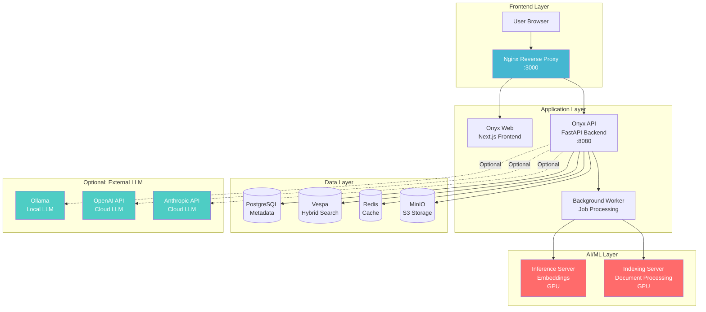
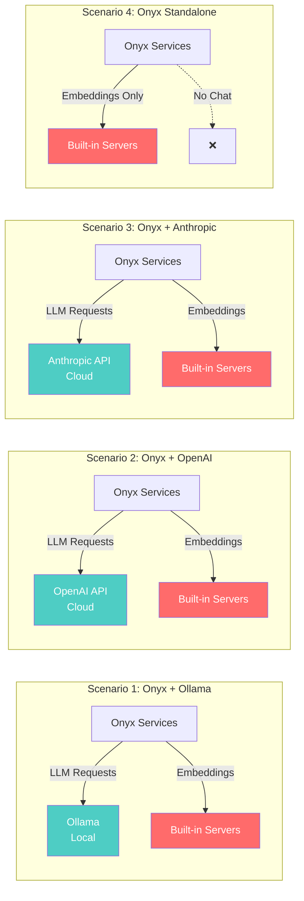
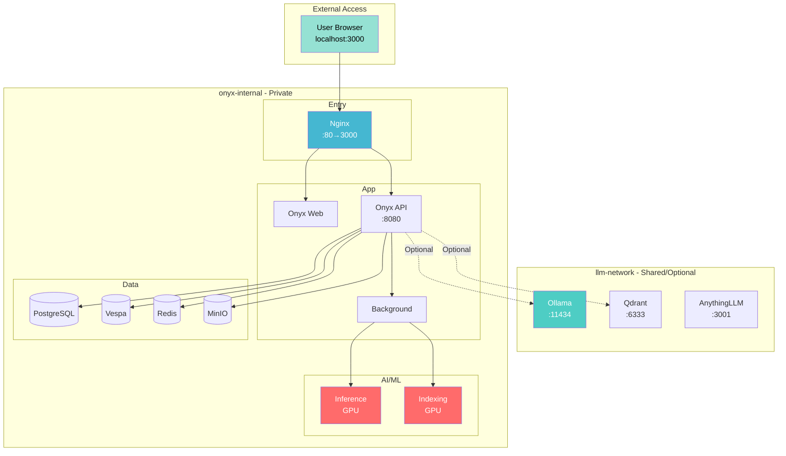

# Onyx Architecture & LLM Integration Guide

## Onyx is Completely Independent ✅

**Key Concept:** Onyx does NOT depend on Ollama or any specific LLM service.

### Onyx Core Architecture

```
Onyx Standalone Services (Full Functionality)
├── onyx-api          # Backend API server
├── onyx-background   # Background job processor
├── onyx-web          # Frontend web interface
├── onyx-db           # PostgreSQL database
├── onyx-index        # Vespa hybrid search engine
├── onyx-cache        # Redis cache
├── onyx-minio        # S3-compatible object storage
├── onyx-inference    # Built-in inference server (embeddings) ✅
└── onyx-indexing     # Built-in indexing server (embeddings) ✅
```

**Key Point:** Onyx includes its own embedding model servers and can handle document indexing and search independently.

#### Architecture Diagram



## LLM Integration Options (Optional)

Onyx supports multiple LLM providers - you can choose any one:

### Integration Scenarios Overview



### Option 1: Use Ollama (Local, Free)

**Pros:**
- 🆓 Completely free
- 🏠 Runs locally, data privacy
- 🚀 Integrates with your existing Ollama

**Configuration:**
```bash
# config/.env
GEN_AI_MODEL_PROVIDER=ollama
GEN_AI_LLM_PROVIDER_TYPE=ollama
GEN_AI_API_ENDPOINT=http://ollama:11434
```

**Startup:**
```bash
# Start Ollama first
docker compose -f docker-compose.yml up -d ollama

# Then start Onyx
docker compose -f docker-compose.onyx.yml up -d
```

### Option 2: Use OpenAI (Cloud, Paid)

**Pros:**
- 🌐 No local GPU needed
- 🎯 Latest GPT models
- ⚡ Fast response

**Configuration:**
```bash
# config/.env
GEN_AI_MODEL_PROVIDER=openai
OPENAI_API_KEY=sk-your-api-key-here
GEN_AI_API_VERSION=gpt-4
```

**Startup:**
```bash
# Only start Onyx (no Ollama needed)
docker compose -f docker-compose.onyx.yml up -d
```

### Option 3: Use Anthropic Claude (Cloud, Paid)

**Configuration:**
```bash
# config/.env
GEN_AI_MODEL_PROVIDER=anthropic
ANTHROPIC_API_KEY=your-api-key-here
```

### Option 4: Use Only Onyx Built-in Servers (Embeddings Only)

**Use Case:** Document search only, no chat functionality needed

**Configuration:**
```bash
# config/.env
# Don't configure any external LLM
DISABLE_MODEL_SERVER=false  # Use built-in embedding servers
```

**Features:**
- ✅ Document upload and indexing
- ✅ Semantic search
- ✅ Hybrid search (BM25 + Dense + Sparse)
- ❌ Chat generation (requires external LLM)

## Network Architecture Explained

### Current Configuration (Two Networks):

```yaml
networks:
  llm-network:      # Shared network (optional)
    external: true  # Connects to Ollama (if used)

  onyx-internal:    # Onyx internal network (required)
    driver: bridge  # Communication between Onyx services
```

#### Network Topology Diagram



### Network Usage Scenarios:

**Scenario 1: Using Ollama**
- Onyx services join both `llm-network` and `onyx-internal`
- Can access `ollama:11434`

**Scenario 2: Standalone (OpenAI/Anthropic)**
- Onyx services only need `onyx-internal`
- Access external APIs via internet

**Scenario 3: Completely Offline (Built-in Servers Only)**
- Onyx services only need `onyx-internal`
- No external connections needed

## Optional: Remove llm-network Dependency

If you want Onyx to be completely independent, you can simplify:

### Simplified docker-compose.onyx.yml

```yaml
services:
  onyx-api:
    networks:
      - onyx-internal  # Only use internal network

  onyx-background:
    networks:
      - onyx-internal

networks:
  onyx-internal:
    driver: bridge
  # Remove llm-network (if not using Ollama)
```

## Usage Recommendations

### 🎯 Recommended Configuration (Maximum Flexibility)

Keep current configuration:
- ✅ Both networks configured
- ✅ Choose LLM provider in `.env`
- ✅ Start only Onyx when Ollama not needed

### Startup Commands Comparison:

**With Ollama:**
```bash
docker compose -f docker-compose.yml -f docker-compose.onyx.yml up -d
```

**Without Ollama (Standalone):**
```bash
# Start only Onyx
docker compose -f docker-compose.onyx.yml up -d

# Configure OpenAI or Anthropic
cp config/.env.example .env
nano .env  # Set OPENAI_API_KEY or ANTHROPIC_API_KEY
```

## FAQ

### Q: Does Onyx require GPU?
**A:** No, it's optional.
- Onyx model servers can run on CPU (slower)
- Can disable built-in model servers: `DISABLE_MODEL_SERVER=true`
- Cloud LLMs (OpenAI/Anthropic) don't need local GPU

### Q: Can I use both Ollama and OpenAI?
**A:** Yes! Onyx UI allows configuring multiple LLM providers and switching between them dynamically.

### Q: Can Onyx run without any LLM?
**A:** Yes, but with limited functionality:
- ✅ Document upload and search
- ✅ Connector sync (Google Drive, Notion, etc.)
- ❌ Chat features (requires LLM)
- ❌ Agents (requires LLM)

## Summary

| Running Mode | Onyx Standalone | Needs Ollama | Needs Internet | Cost |
|--------------|-----------------|--------------|----------------|------|
| **Onyx + Ollama** | ✅ | ✅ | ❌ | Free |
| **Onyx + OpenAI** | ✅ | ❌ | ✅ | Paid |
| **Onyx + Anthropic** | ✅ | ❌ | ✅ | Paid |
| **Onyx Search Only** | ✅ | ❌ | ❌ | Free |

**Conclusion:** Onyx is a completely independent service. Ollama is just one of many LLM options!
