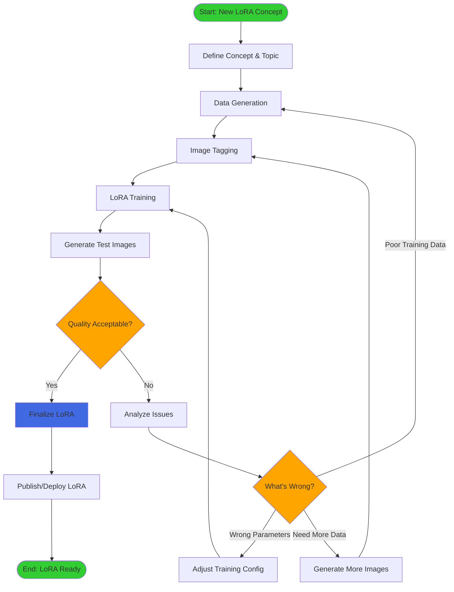
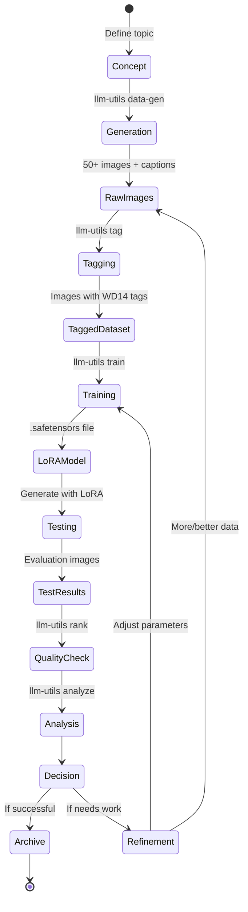
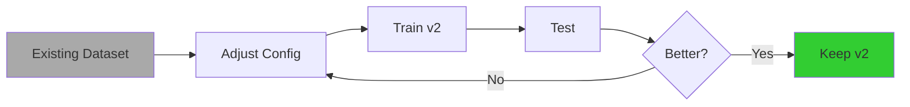
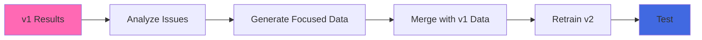
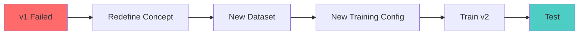
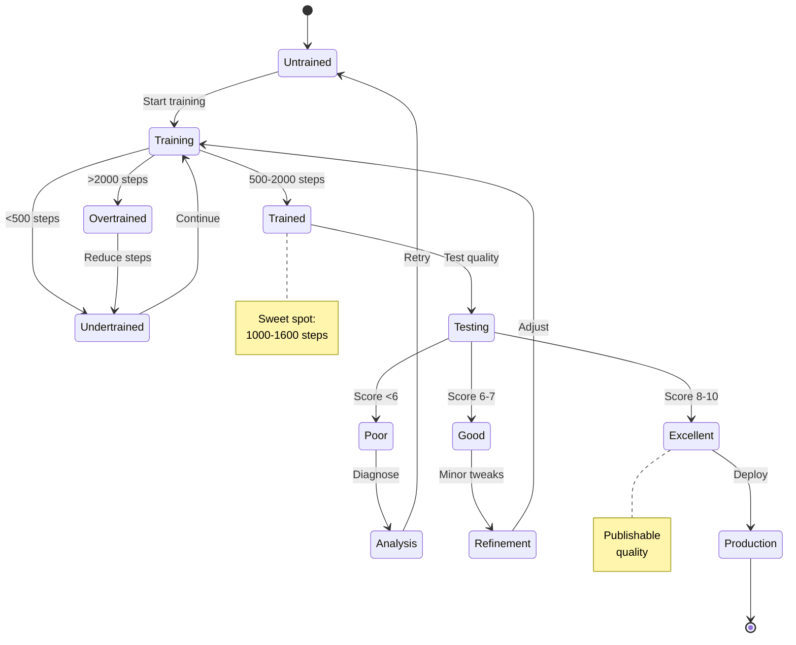
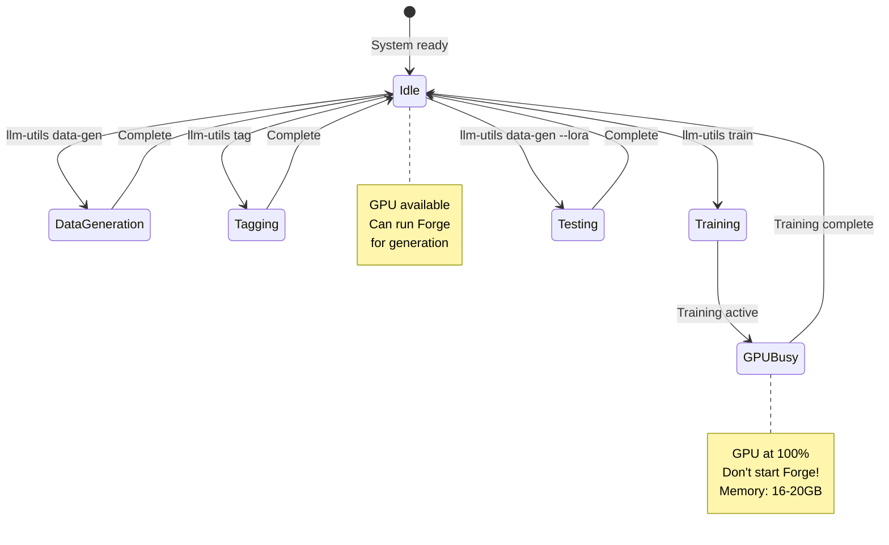
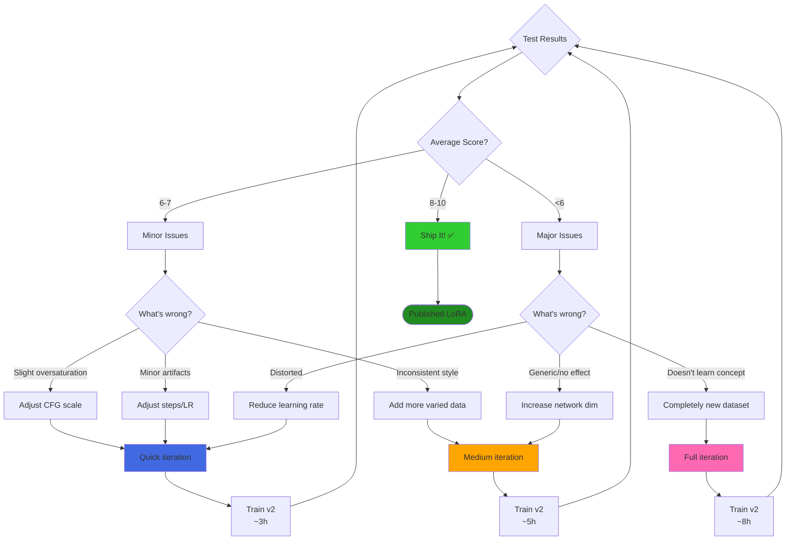
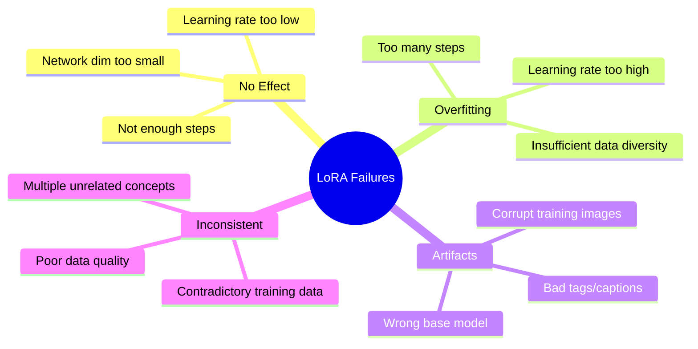

# LoRA Development Lifecycle

## Overview

This document describes the complete lifecycle of LoRA model development using llm-utils.

## Development Lifecycle Diagram



## Data Lifecycle



## Typical Timeline

```mermaid
gantt
    title LoRA Development Timeline (Single Iteration)
    dateFormat  HH:mm
    axisFormat %H:%M

    section Data Prep
    Generate 50 images      :data1, 00:00, 2h
    Tag images             :data2, after data1, 10m
    Review & filter        :data3, after data2, 20m

    section Training
    Setup config           :train1, after data3, 15m
    Train LoRA (1600 steps):train2, after train1, 3h

    section Testing
    Generate test images   :test1, after train2, 30m
    Rank images           :test2, after test1, 10m
    Analyze best results  :test3, after test2, 20m

    section Decision
    Review & decide       :dec1, after test3, 30m
```



**Total Time: ~7-8 hours per iteration**

## Iteration Patterns

### Pattern 1: Quick Iteration (Testing Parameters)



**Timeline**: 3-4 hours (skip data generation)

### Pattern 2: Data Refinement



**Timeline**: 5-6 hours (targeted data generation)

### Pattern 3: Complete Overhaul



**Timeline**: Full 7-8 hours (start from scratch)

## State Machine: LoRA Quality States



## Resource State Machine



## Decision Tree: When to Iterate



## Best Practices

### Data Generation Phase
- **Diversity**: Vary prompts, angles, lighting, time of day
- **Quality over Quantity**: 50 good images > 200 mediocre
- **Consistency**: Ensure concept is clear in all images

### Training Phase
- **Start Conservative**:
  - network_dim: 128
  - learning_rate: 1 (with Prodigy)
  - steps: 1200-1600

- **Monitor Loss**: Should decrease steadily

### Testing Phase
- **Generate Variety**: Test different scenarios
- **Batch Evaluate**: Use `llm-utils rank` on all test images
- **Deep Dive**: Use `llm-utils analyze` on best AND worst

### Iteration Strategy
1. **First Iteration**: Always complete (data + train + test)
2. **Second Iteration**: Usually parameter tweaks (3-4h)
3. **Third+ Iteration**: Only if needed (diminishing returns)

## Common Failure Modes



## Success Metrics

| Metric | Poor | Acceptable | Excellent |
|--------|------|------------|-----------|
| Average Rank Score | <5 | 6-7 | 8-10 |
| Concept Recognition | Weak | Clear | Strong |
| Style Consistency | Varies | Mostly | Always |
| Artifact Presence | Frequent | Rare | None |
| Training Time | >8h iterations | 4-6h iterations | 3-4h iterations |

## Automation Opportunities

```bash
# Full automated workflow (with human checkpoints)
#!/bin/bash

# Phase 1: Data Generation
llm-utils data-gen --topic "$CONCEPT" --total 50 --output ./dataset
echo "Review generated images. Continue? (y/n)"
read response
[[ "$response" != "y" ]] && exit

# Phase 2: Tagging
llm-utils tag --path ./dataset

# Phase 3: Training
llm-utils train --config $CONFIG_PATH
echo "Training complete. Test? (y/n)"
read response
[[ "$response" != "y" ]] && exit

# Phase 4: Testing
llm-utils data-gen --lora "${CONCEPT}_v1.safetensors" --total 10 --output ./test
llm-utils rank --dir ./test

echo "Check results and decide on next iteration"
```

This represents the complete lifecycle from concept to published LoRA! 🎯
