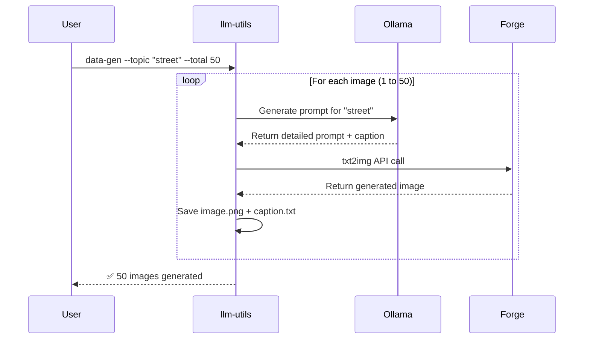
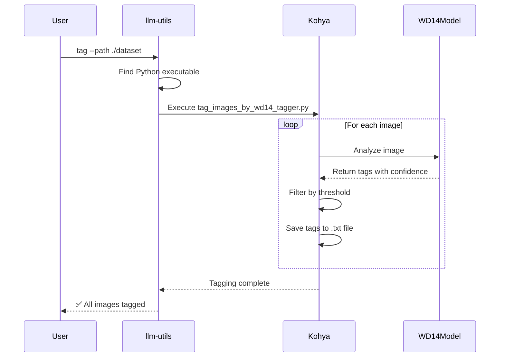
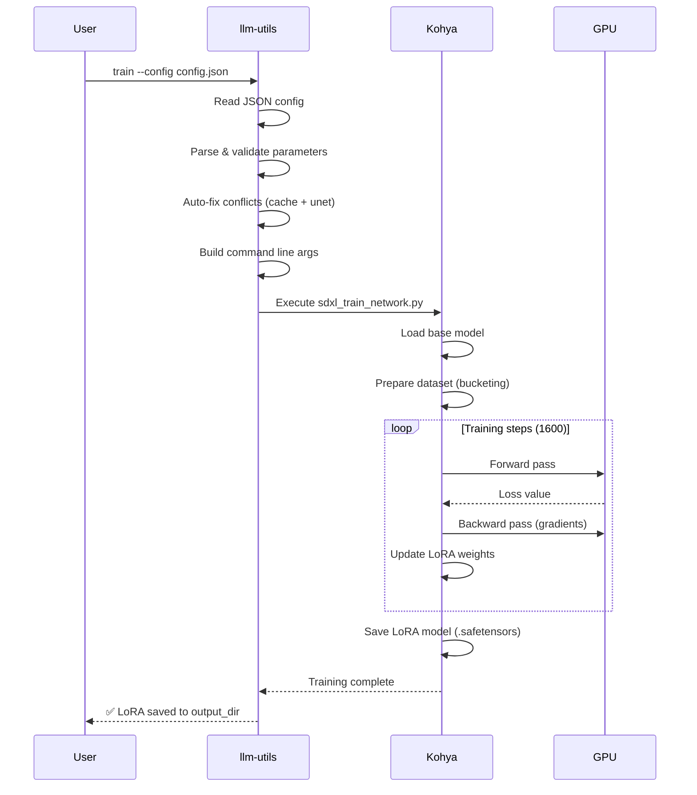
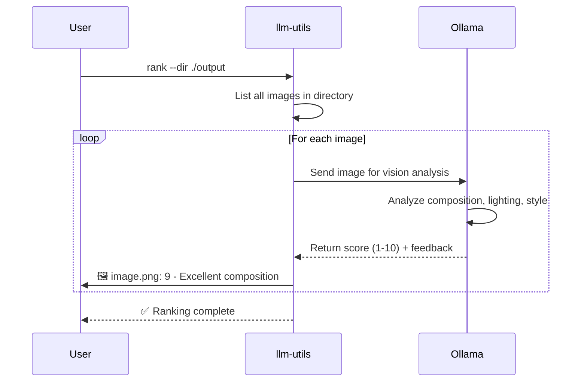
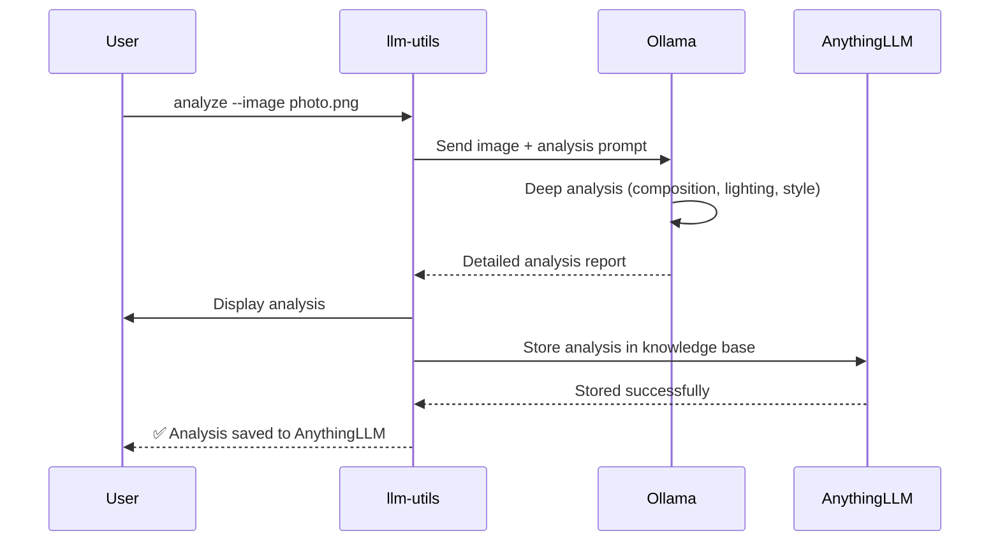
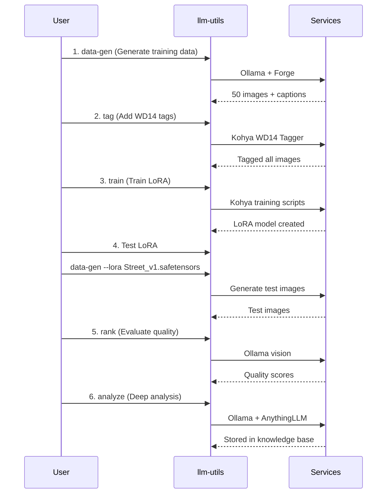

# llm-utils Sequence Flows

> **See also**: [LoRA Development Lifecycle](./lifecycle.md) - Complete development lifecycle, iteration patterns, and state machines

## Table of Contents

1. [Data Generation Flow](#1-data-generation-flow)
2. [Image Tagging Flow](#2-image-tagging-flow)
3. [LoRA Training Flow](#3-lora-training-flow)
4. [Image Ranking Flow](#4-image-ranking-flow)
5. [Image Analysis Flow](#5-image-analysis-flow)
6. [Complete Workflow](#6-complete-workflow-end-to-end)

## 1. Data Generation Flow

### Diagram



### Process Explanation

**Step 1: User Initiates Generation**
- User executes `llm-utils data-gen` with topic and count
- Optional: Can specify LoRA model, weight, manual prompt

**Step 2-5: Generation Loop (for each image)**

1. **Prompt Generation (Ollama)**
   - llm-utils sends topic to Ollama LLM
   - Ollama generates unique, detailed SDXL prompt
   - Returns both prompt (for image generation) and caption (for training)
   - Ensures diversity by tracking iteration number

2. **Image Generation (Forge)**
   - llm-utils calls Stable Diffusion Forge API
   - Passes the generated prompt
   - Forge renders image using base model + optional LoRA
   - Returns PNG image data

3. **File Saving**
   - Saves image as `{timestamp}_{number}.png`
   - Saves caption as `{timestamp}_{number}.txt`
   - Stores in specified output directory

**Step 6: Completion**
- Reports total images generated
- Ready for tagging or training

---

## 2. Image Tagging Flow

### Diagram



### Process Explanation

**Step 1: User Initiates Tagging**
- Specifies directory containing images
- Optionally sets thresholds and undesired tags

**Step 2: Python Path Detection**
- llm-utils locates correct Python executable
- Checks for `python.exe` (Windows) first
- Falls back to `bin/python` (Linux)

**Step 3: Execute Kohya Tagger**
- Runs `tag_images_by_wd14_tagger.py` script
- Passes directory path and parameters
- Script initializes WD14 vision model

**Step 4-7: Tagging Loop (for each image)**

1. **Image Analysis**
   - Kohya loads image and preprocesses
   - Sends to WD14 ConvNeXt model
   - Model analyzes visual content

2. **Tag Extraction**
   - WD14 returns tags with confidence scores
   - E.g., `{"1girl": 0.95, "street": 0.87, "outdoors": 0.78}`

3. **Filtering**
   - Removes tags below threshold (default 0.35)
   - Removes undesired tags (watermark, text, etc.)
   - Separates character tags vs general tags

4. **Save to File**
   - Appends or overwrites `.txt` caption file
   - Format: `tag1, tag2, tag3` (comma-separated)

**Step 8-9: Completion**
- Reports tagging statistics
- Shows tag frequency if requested

---

## 3. LoRA Training Flow

### Diagram



### Process Explanation

**Step 1: User Initiates Training**
- Provides JSON config file (exported from Kohya GUI or hand-written)
- Config contains all training parameters (learning rate, network dim, etc.)

**Step 2-5: Config Processing**

1. **Read JSON Config**
   - Parse JSON file into map structure
   - Validate required fields

2. **Validate Parameters**
   - Check for conflicting settings
   - Verify paths exist

3. **Auto-fix Conflicts**
   - If `cache_text_encoder_outputs`, add `--network_train_unet_only`
   - Map deprecated parameters (e.g., `sdxl_cache_text_encoder_outputs` → `cache_text_encoder_outputs`)
   - Skip GUI-only fields (`epoch`, `model_list`, etc.)

4. **Build Command**
   - Convert JSON to command-line arguments
   - Separate Accelerate args from training script args

**Step 6-10: Training Execution**

1. **Execute Training Script**
   - Runs `sdxl_train_network.py` via Accelerate
   - Loads base SDXL model into GPU memory

2. **Dataset Preparation**
   - Scans training directory for images
   - Creates buckets by resolution (e.g., 1024x1024)
   - Preprocesses and caches latents to disk
   - Calculates total steps based on images and repeats

3. **Training Loop**
   - For each step (1-1600):
     - Forward pass: generate predictions
     - Calculate loss (L2, Huber, etc.)
     - Backward pass: compute gradients
     - Update LoRA weights using optimizer (Prodigy, AdamW, etc.)
   - Gradient accumulation every N steps

4. **Save Model**
   - Saves LoRA weights as `.safetensors` file
   - Includes metadata (network dim, alpha, training params)

**Step 11-12: Completion**
- Reports training complete
- LoRA ready for use in Stable Diffusion

---

## 4. Image Ranking Flow

### Diagram



### Process Explanation

**Step 1: User Initiates Ranking**
- Specifies directory containing generated images
- Can optionally filter by file pattern

**Step 2: List Images**
- Scans directory for image files (PNG, JPG, etc.)
- Sorts by filename for consistent ordering

**Step 3-6: Ranking Loop (for each image)**

1. **Send to Vision Model**
   - Encodes image as base64
   - Sends to Ollama with llama3.2-vision model
   - Includes ranking criteria in prompt

2. **AI Analysis**
   - Ollama analyzes:
     - Composition (rule of thirds, balance, focal point)
     - Lighting (natural/dramatic, shadows, highlights)
     - Visual appeal (colors, clarity, detail)
     - Style consistency (matches intended aesthetic)

3. **Return Score**
   - Score from 1-10
   - Brief explanation of score
   - Specific feedback on strengths/weaknesses

4. **Display to User**
   - Shows each image's score in real-time
   - Helps identify best images for selection

**Step 7: Completion**
- All images ranked
- User can manually review high-scoring images

**Use Cases:**
- Filter training data (keep only 8+ scores)
- Compare different LoRA weights
- Evaluate prompt variations

---

## 5. Image Analysis Flow

### Diagram



### Process Explanation

**Step 1: User Initiates Analysis**
- Specifies single image for deep analysis
- Can be used on generated images or reference images

**Step 2-3: Deep Analysis**

1. **Send to Vision LLM**
   - Encodes image as base64
   - Sends with comprehensive analysis prompt
   - Requests detailed breakdown

2. **AI Analysis**
   - Much more detailed than ranking
   - Analyzes:
     - **Composition**: Layout, perspective, focal points, leading lines
     - **Lighting**: Type, direction, mood, quality
     - **Style**: Aesthetic, genre, FancyStyle characteristics
     - **Technical Quality**: Sharpness, artifacts, color accuracy
     - **Suggestions**: Specific improvements for next iteration

**Step 4: Display Results**
- Shows full analysis report to user
- Formatted as markdown for readability

**Step 5-6: Knowledge Base Storage**

1. **Store in AnythingLLM**
   - Sends analysis text to AnythingLLM API
   - Links to image filename
   - Stores in specified workspace

2. **Confirmation**
   - Reports successful storage
   - Analysis now searchable in AnythingLLM

**Step 7: Completion**
- User has detailed understanding of image
- Knowledge accumulated for future reference

**Use Cases:**
- Understand why certain images work better
- Learn from successful generations
- Build searchable knowledge base of techniques
- Query: "What lighting techniques worked best in street scenes?"

---

## 6. Complete Workflow (End-to-End)

### Diagram



### Complete Workflow Explanation

This is the typical end-to-end workflow for creating and refining a custom LoRA model.

**Phase 1: Data Generation (Steps 1-2)**
1. Generate initial training dataset
   - 50+ images with captions
   - Diverse prompts from Ollama
2. Add detailed tags
   - WD14 model provides accurate tags
   - Improves training quality

**Phase 2: Training (Step 3)**
3. Train LoRA model
   - Uses tagged dataset
   - Runs for 1600 steps
   - Produces `Street_v1.safetensors`

**Phase 3: Testing & Iteration (Steps 4-6)**
4. Generate test images
   - Use newly trained LoRA
   - Verify it learned the concept

5. Evaluate quality
   - Rank test images (1-10 scores)
   - Find best results

6. Deep analysis
   - Analyze top-scoring images
   - Understand what works
   - Store insights in knowledge base

**Iteration Loop:**
If results aren't satisfactory:
- Adjust training parameters
- Generate more/better training data
- Retrain and test again

**Typical Timeline:**
- Data generation: 1-2 hours (50 images)
- Tagging: 5-10 minutes
- Training: 2-4 hours (1600 steps on RTX 4090)
- Testing & evaluation: 30-60 minutes
- **Total: 4-8 hours per LoRA iteration**

**Automation Benefits:**
All steps are automatable via llm-utils:
```bash
# Complete workflow in one script
llm-utils data-gen --topic "street" --total 50
llm-utils tag --path ./dataset/street
llm-utils train --config street_config.json
llm-utils data-gen --lora Street_v1.safetensors --total 10
llm-utils rank --dir ./test_output
llm-utils analyze --image ./test_output/best_001.png
```
