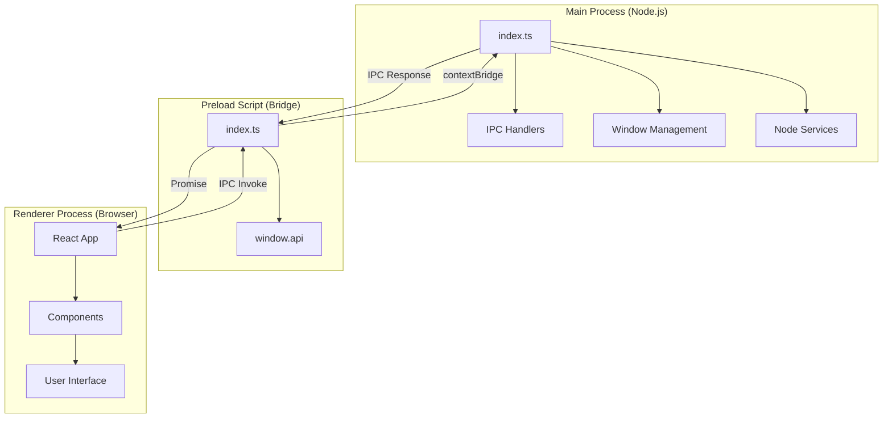
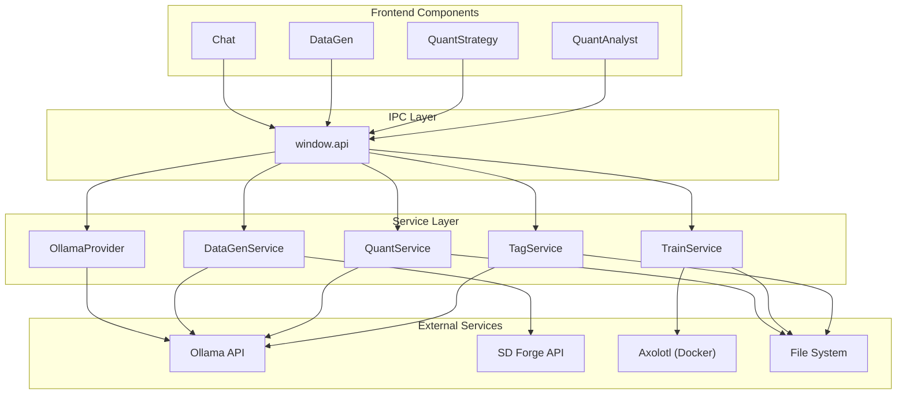

# LLM Utils Desktop - Electron Application Architecture

## Project Overview

The LLM Utils Desktop is an Electron-based desktop application that provides a graphical interface for various LLM-powered utilities, including chat, image generation, and quantitative trading strategy development.

## Technology Stack

- **Framework**: Electron v31 + Vite + React 19
- **Language**: TypeScript
- **Styling**: LESS (VS Code-inspired theme)
- **Icons**: Lucide React
- **Animation**: Framer Motion
- **Build Tool**: electron-vite
- **Package Manager**: npm (managed by pixi)

## Project Structure

```
llm-playground/
├── cmd/
│   └── node/
│       └── llm-utils-desktop/     # Electron App Root
│           ├── src/
│           │   ├── main/          # Electron Main Process
│           │   ├── renderer/      # React Frontend
│           │   └── preload/       # IPC Bridge
│           ├── out/               # Build output
│           ├── electron.vite.config.ts
│           └── package.json
├── internal/
│   └── node/                      # Shared Node.js Logic
│       ├── services/
│       │   ├── ollama.ts
│       │   ├── quant-service.ts
│       │   └── datagen-service.ts
│       └── types.ts
├── deployments/
│   └── docker-compose/            # Docker Services
│       ├── lab/                   # Main Stack (Ollama, Onyx, etc.)
│       └── axolotl/               # Training Stack
└── documents/                     # Documentation
```

## Electron Architecture

### Three-Process Model



### 1. Main Process (`src/main/index.ts`)

**Responsibilities**:
- Window lifecycle management
- IPC handler registration
- File system access
- Native OS integrations

**Key Features**:
```typescript
// Frameless window for custom title bar
const mainWindow = new BrowserWindow({
    frame: false,
    webPreferences: {
        preload: join(__dirname, '../preload/index.js'),
        contextIsolation: true,
        sandbox: false
    }
});

// Hardware acceleration disabled for WSL compatibility
app.disableHardwareAcceleration();
```

**IPC Handlers**:
| Channel | Purpose | Handler |
|---------|---------|---------|
| `llm:chat` | LLM conversation | `OllamaProvider` |
| `llm:models` | List available models | `OllamaProvider` |
| `datagen:*` | Image generation (start/cancel/isBusy) | `DataGenService` |
| `tag:*` | Dataset tagging (start/cancel/isRunning) | `TagService` |
| `train:*` | LoRA training (start/cancel/isRunning) | `TrainService` |
| `quant:generate` | Generate Pine Script | `QuantService` |
| `quant:analyst` | Analyze market data | `QuantService` |
| `system:selectFiles` | Native file picker | Electron Dialog |
| `system:openPath` | Open folder in explorer (WSL aware) | Electron Shell / PowerShell |
| `window-*` | Window controls | BrowserWindow API |

### 2. Preload Script (`src/preload/index.ts`)

**Responsibility**: Secure bridge between renderer and main process.

```typescript
const api = {
    // LLM Operations
    chat: (messages, config) => ipcRenderer.invoke('llm:chat', messages, config),
    listModels: (provider, baseUrl) => ipcRenderer.invoke('llm:models', provider, baseUrl),

    // Data Generation & Tools
    startDataGen: (options, llmConfig, forgeConfig) =>
        ipcRenderer.invoke('datagen:start', options, llmConfig, forgeConfig),
    startTagging: (options) => ipcRenderer.invoke('tag:start', options),
    startTraining: (configPath) => ipcRenderer.invoke('train:start', configPath),

    // Quant Operations
    generateStrategy: (options, llmConfig) =>
        ipcRenderer.invoke('quant:generate', options, llmConfig),
    runQuantAnalyst: (options, llmConfig) =>
        ipcRenderer.invoke('quant:analyst', options, llmConfig),

    // Status Checks (Persistence)
    isTaggingRunning: () => ipcRenderer.invoke('tag:isRunning'),
    isTrainingRunning: () => ipcRenderer.invoke('train:isRunning'),
    isDataGenBusy: () => ipcRenderer.invoke('datagen:isBusy'),
};

contextBridge.exposeInMainWorld('api', api);
```

### 3. Renderer Process (`src/renderer/src/`)

**Responsibility**: User interface and interaction logic.
**Architecture Pattern**: Component-based React with centralized state.

## UI Architecture

### Visual Layout

```
┌─────────────────────────────────────────────────────────┐
│  Custom Title Bar                            [ _ □ X ]  │
├─────┬───────────────────────────────────────────────────┤
│  A  │  Sidebar                │  Main Content           │
│  c  │                         │                         │
│  t  │  [Configuration]        │  [Active Feature]       │
│  i  │  - LLM Provider         │                         │
│  v  │  - Model Selection      │  Chat / DataGen /       │
│  i  │  - Base URL             │  Quant Strategy /       │
│  t  │                         │  Quant Analyst          │
│  y  │                         │                         │
│     │                         │                         │
│  B  │                         │                         │
│  a  │                         │                         │
│  r  │                         │                         │
│     │                         │                         │
├─────┴─────────────────────────┴─────────────────────────┤
│  Status Bar: Model: llama3.1:8b | Requests: 42          │
└─────────────────────────────────────────────────────────┘
```

### Component Hierarchy

```
App.tsx (Root)
├── TitleBar
├── Layout Container
│   ├── ActivityBar
│   │   ├── Chat Icon
│   │   ├── DataGen Icon
│   │   ├── Strategy Icon
│   │   └── Analyst Icon
│   ├── Sidebar
│   │   └── LLM Configuration
│   └── Main Content
│       ├── Chat Component (tab: 'chat')
│       ├── DataGen Component (tab: 'datagen')
│       ├── QuantStrategy Component (tab: 'strategy')
│       └── QuantAnalyst Component (tab: 'analyst')
└── StatusBar
```

## Service Layer Architecture

### Design Pattern: Service-based with Provider Abstraction



### 1. OllamaProvider (`internal/node/services/ollama.ts`)
Handles LLM communication with streaming support to prevent timeouts on large models (32b+).

### 2. QuantService (`internal/node/services/quant-service.ts`)
Handles CSV parsing, timeframe detection, and multi-timeframe formatting for the "Quant Analyst" and "Strategy Gen" workflows.
- **Projects Root Resolution**: Calculates `../../../../../` to find the project root from the compiled Electron output directory.

### 3. DataGenService (`internal/node/services/datagen-service.ts`)
Manages the image generation workflow using Stable Diffusion Forge.
- **Searchable Selector**: Allows filtering through large lists of LoRA models.
- **Flexible Paths**: Supports both auto-generated topic folders and explicit user-selected directories.

### 4. TrainService (`internal/node/services/train-service.ts`)
Orchestrates training jobs.
- **Kohya_ss**: For LoRA training via `accelerate` on native WSL.
- **Axolotl**: Triggers Docker-based fine-tuning jobs (future integration).
- **Process Management**: Uses negative PID killing to ensure all subprocesses (Python, accelerate) are terminated on cancel.

### 5. TagService (`internal/node/services/tag-service.ts`)
Interacts with the WD14 Tagger via Forge or local Python scripts to caption datasets.

## Build & Development

### Development Mode

```bash
pixi run desktop-dev
# Starts Vite dev server (renderer) + Electron (main) with hot reload
```

### Build Process

```bash
pixi run desktop-build
# Compiles TypeScript, bundles with Vite, and packages with Electron to `out/`
```

### File Structure After Build

```
cmd/node/llm-utils-desktop/out/
├── main/
│   ├── index.js              # Main process entry point
│   └── ...
├── preload/
│   └── index.js              # Preload script
└── renderer/
    ├── index.html            # Entry HTML
    └── assets/               # Bundled assets
```

## Configuration Files

- `electron.vite.config.ts`: Vite config for Main, Preload, and Renderer.
- `tsconfig.*.json`: Separate configs for Node (Main/Preload) and Web (Renderer) environments.

## Deployment

### Platform Support

- **Primary**: Linux (WSL Ubuntu 24.04)
- **Hardware Acceleration**: Disabled (WSL compatibility)

### Distribution

```bash
# Build distributables (AppImage, Deb)
npm run build:linux --prefix cmd/node/llm-utils-desktop
```

## Related Documentation

- [Quant Analyst Implementation](./quant-analyst-implementation.md)
- [Pine Script v6 Reference](../quant/pine_v6_reference.md)
- [Project Plan](../structure/plan.md)
