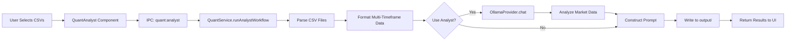

# Quant Analyst Feature Implementation

## Overview

The Quant Analyst feature provides a graphical interface for the `llm-utils quant gen --prompt-only` workflow, enabling multi-timeframe market data analysis and Pine Script prompt generation through the Electron desktop application.

## Architecture

### Components

1. **Frontend**: React component (`QuantAnalyst.tsx`)
2. **Backend Service**: `QuantService.ts` in `internal/node/services/`
3. **LLM Provider**: `OllamaProvider.ts` with streaming support
4. **IPC Communication**: Electron IPC handlers for file selection and analysis

### Data Flow



## Features

### 1. Multi-Timeframe Data Support

Supports loading multiple CSV files with different timeframes:
- Automatically detects timeframe from filename (e.g., `_1h`, `_4h`, `_1d`, `_1w`)
- Formats data with clear timeframe separation
- Provides MTF strategy guidance in the prompt

### 2. Model Selection

Users can choose from available Ollama models:
- Dropdown populated dynamically from `http://127.0.0.1:11434/api/tags`
- Supports large models like `deepseek-r1:32b` and `qwen2.5-coder:32b`
- Separate model selection for analysis phase

### 3. Optional Strategy Logic

The `logic` field is optional:
- If provided: LLM analyzes data according to user's strategy idea
- If empty: LLM provides general market analysis and strategy suggestions

### 4. Prompt Distillation

- **Market Analysis**: LLM analyzes recent price action, trends, and patterns
- **Context Injection**: Includes Pine Script v6 Bible and Golden Templates
- **Output**: A complete prompt ready for Pine Script generation

### 5. Intelligent Multi-Timeframe Candle Limit Adjustment

**Problem**: When analyzing multiple timeframes (e.g., 1H + 4H + 1D + 1W), using the same candle count for all timeframes results in vastly different time periods being analyzed.

Example with limit=200:
- 1H: 200 candles = ~8 days
- 4H: 200 candles = ~33 days
- 1D: 200 candles = ~200 days
- 1W: 200 candles = ~3.8 years

**Solution**: Automatically adjust candle limits to ensure all timeframes cover the **same time period**.

**Implementation**:
```typescript
// 1. Detect largest timeframe (e.g., 1W)
// 2. Use base limit for largest TF: 1W = 200 candles
// 3. Scale other TFs proportionally:
//    - 1H: 200 × (10080/60) = 33,600 candles (168x base)
//    - 4H: 200 × (10080/240) = 8,400 candles (42x base)
//    - 1D: 200 × (10080/1440) = 1,400 candles (7x base)
//    - 1W: 200 candles (base)
```

**Result**: All timeframes now analyze the same ~3.8 year period, providing consistent multi-timeframe context for the LLM.

**Console Output**:
```
Detected timeframes: 1W, 1H, 1D, 4H
Largest timeframe: 1W (base limit: 200)
  1W: 200 candles (base)
  1H: 33600 candles (168.0x base)
  1D: 1400 candles (7.0x base)
  4H: 8400 candles (42.0x base)
```

## Technical Challenges & Solutions

### Challenge 1: Headers Timeout Error

**Problem**:
```
HeadersTimeoutError: Headers Timeout Error
code: 'UND_ERR_HEADERS_TIMEOUT'
```

Node.js's default `fetch` implementation (undici) has a 30-second header timeout. Large models (32b) loading and processing MTF data exceeded this limit.

**Solution**:
Switched from `stream: false` to `stream: true` in `OllamaProvider.chat()`:

```typescript
const response = await fetch(url, {
    method: 'POST',
    headers: { 'Content-Type': 'application/json' },
    body: JSON.stringify({
        model: config.model,
        messages: messages,
        stream: true, // Headers sent immediately
    }),
});

// Manually accumulate streamed response
const reader = response.body.getReader();
const decoder = new TextDecoder();
let fullContent = '';

while (true) {
    const { done, value } = await reader.read();
    if (done) break;

    const chunk = decoder.decode(value, { stream: true });
    const lines = chunk.split('\n');

    for (const line of lines) {
        if (!line.trim()) continue;
        try {
            const json = JSON.parse(line);
            if (json.message && json.message.content) {
                fullContent += json.message.content;
            }
        } catch (e) {
            // Incomplete JSON, continue
        }
    }
}
```

**Why it works**: Streaming mode forces Ollama to send HTTP headers immediately, preventing timeout while model loads and processes data.

### Challenge 2: Project Root Path Resolution

**Problem**:
Output files were being written to `cmd/node/llm-utils-desktop/output/` instead of the project root's `output/`.

**Root Cause**:
```
Compiled Electron app structure:
out/main/index.js <- __dirname is here
    ↓
out/ (1 level up)
    ↓
llm-utils-desktop/ (2 levels up)
    ↓
node/ (3 levels up)
    ↓
cmd/ (4 levels up)
    ↓
llm-playground/ (5 levels up) <- Project root!
```

**Solution**:
```typescript
const projectRoot = path.resolve(__dirname, '../../../../../');
```

All file operations (reading Bible/templates, writing output) now correctly target the project root.

### Challenge 3: Optional Logic Field

**Problem**:
Users may not always have a specific strategy idea when exploring market data.

**Solution**:
Made `logic` optional in the entire stack:

1. **Types** (`internal/node/types.ts`):
```typescript
export interface QuantAnalystOptions {
    logic?: string; // Optional
    // ...
}
```

2. **Backend** (`QuantService.ts`):
```typescript
private async analyzeMarketData(
    provider: LLMProvider,
    config: LLMConfig,
    allData: TimeframeData[],
    logic?: string // Optional parameter
): Promise<string> {
    const idea = logic?.trim() || "general market trend and potential strategy opportunities";
    // Use fallback if empty
}
```

3. **Frontend** (`QuantAnalyst.tsx`):
```typescript
const [options, setOptions] = useState<QuantAnalystState>({
    logic: '', // Empty by default
    // ...
})
```

## Configuration

### Default Settings

```typescript
{
    inputs: [],           // CSV file paths
    logic: '',            // Optional strategy description
    limit: 50,            // Last N candles per timeframe
    useAnalyst: true,     // Enable LLM analysis
    distill: true,        // Use distilled analysis in prompt
    promptOnly: true,     // Generate prompt file only
    outputFile: 'output/trade_strategy/sol_analysis_prompt.txt',
    model: 'llama3.1:8b'  // Default model
}
```

### Ollama Connection

- **Default Host**: `http://127.0.0.1:11434` (not `localhost` for better WSL compatibility)
- **Streaming**: Enabled by default
- **Model Selection**: Dynamic dropdown from `/api/tags`

## File Structure

```
cmd/node/llm-utils-desktop/
├── src/
│   ├── main/
│   │   └── index.ts              # IPC handlers
│   ├── renderer/
│   │   └── src/
│   │       └── components/
│   │           └── QuantAnalyst/
│   │               ├── QuantAnalyst.tsx   # UI Component
│   │               └── QuantAnalyst.less  # Styling
│   └── preload/
│       └── index.ts              # IPC bridge

internal/node/
├── services/
│   ├── quant-service.ts          # Core business logic
│   └── ollama.ts                 # LLM provider
└── types.ts                      # Shared TypeScript interfaces
```

## Usage

1. **Select CSV Files**: Click "Add Data Records" to open file dialog
2. **Choose Model**: Select desired LLM from dropdown (e.g., `deepseek-r1:32b`)
3. **Enter Strategy Logic** (Optional): Describe your strategy idea or leave empty
4. **Configure Options**:
   - Candle Limit: Number of recent candles per timeframe
   - Market Analysis: Enable LLM-powered analysis
   - Distill Data: Use analysis summary instead of raw data
5. **Run Analysis**: Click "Run Analysis & Distill"
6. **View Results**:
   - Analysis displayed in right panel
   - Prompt file saved to `output/trade_strategy/`

## Best Practices

### Model Selection

- **Small tasks** (1-2 CSVs, ≤50 candles): `llama3.1:8b`, `qwen2:7b-instruct`
- **Complex analysis** (4+ CSVs, MTF strategies): `deepseek-r1:32b`, `qwen2.5-coder:32b`
- **VRAM constraints**: Monitor GPU usage with `nvidia-smi`

### Performance Tips

1. **Candle Limit**: Start with 50, increase only if needed
2. **Distillation**: Always enable for large datasets (reduces prompt size)
3. **Large Models**: Close other GPU-intensive apps when using 32b models
4. **Streaming**: Never disable (prevents timeouts)

## Debugging

### Enable Debug Logs

Terminal output shows:
```
QuantAnalyst Options Received: {
  inputs: 4,
  logic: 'EMA crossover',
  projectRoot: '/home/user/llm-playground'  # Verify this path
}
Attempting to write constructed prompt to: output/trade_strategy/...
Successfully wrote prompt to: /home/user/llm-playground/output/...
```

### Common Issues

1. **"fetch failed"** → Check Ollama is running: `curl http://127.0.0.1:11434/api/tags`
2. **Headers Timeout** → Ensure streaming is enabled (check `ollama.ts`)
3. **Wrong output path** → Verify `projectRoot` in terminal logs
4. **No models found** → Start Ollama service: `ollama serve`

## Future Enhancements

- [ ] Progress bar for long-running analysis
- [ ] Batch processing multiple strategy ideas
- [ ] Export analysis as Markdown report
- [ ] Integration with RAG for dynamic documentation lookup
- [ ] Support for additional LLM providers (OpenAI, Anthropic)
- [ ] Real-time streaming of analysis results

## Related Documentation

- [Pine Script v6 Reference](../quant/pine_v6_reference.md)
- [Golden Templates](../quant/golden_templates.md)
- [Electron Desktop App Architecture](./architecture.md) *(to be created)*
