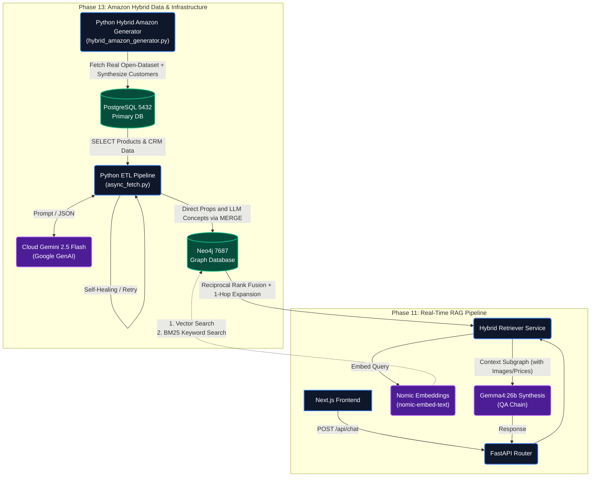
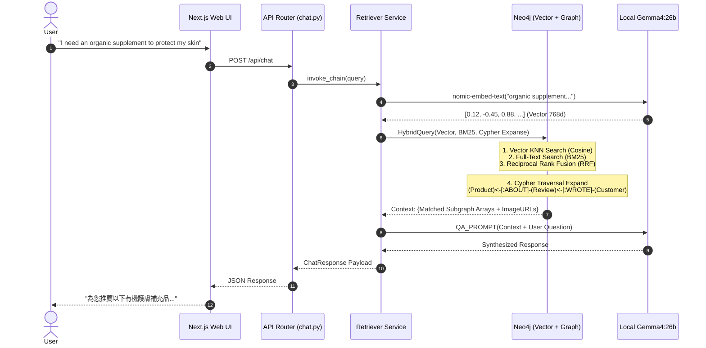
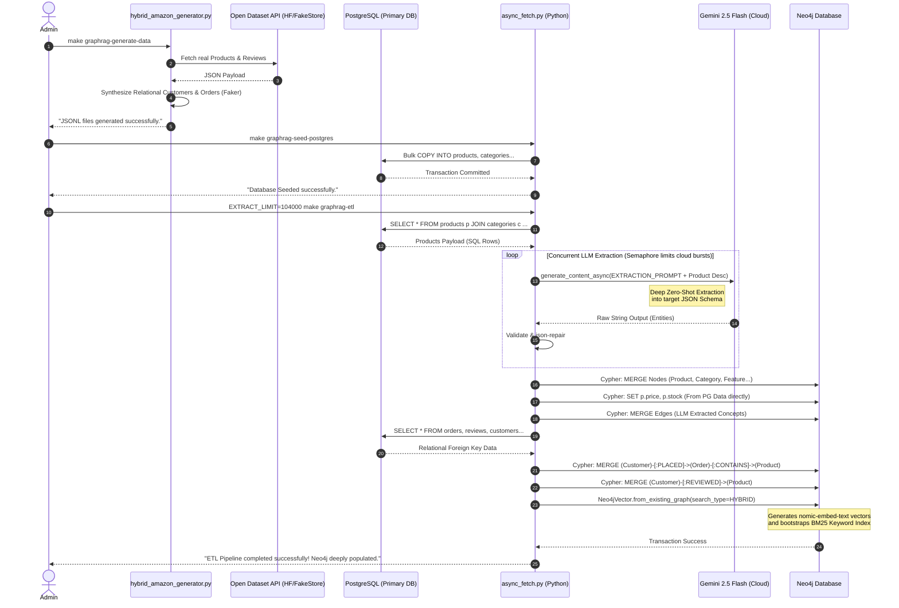

# Enterprise Hybrid Knowledge GraphRAG Architecture

This document describes the Phase 12 & 13 production-grade Hybrid GraphRAG system. It outlines how a primary relational database (PostgreSQL) interacts via asynchronous event-driven pipelines (ETL) to feed a deeply connected Graph and Vector database (Neo4j) for Semantic RAG reasoning.

## 1. Unified System Architecture Diagram

The system operates across a **Primary Transactional Layer (ACID)** and a **Knowledge Retrieval Layer (Graph & Vector)**, linked by an **Asynchronous ETL Ingestion Pipeline**.

## 2. Infrastructure Deployment (Phase 12)

To ensure cohesive local mirroring of a production setup, all data stores are unified into a single Docker Compose execution target:

- **Directory**: `deployments/docker-compose/graphrag-ecommerce/docker-compose.yml`
- **Execution Target**: `make graphrag-db-up`

### Databases:
- **PostgreSQL (`pgvector`)**: Handles user carts, CRM data, raw product schemas, structured pricing, customer reviews, and orders acting as the ACID Source of Truth.
- **Neo4j (`7474/7687`)**: Acts as the highly-optimized read-replica Semantic Retrieval Engine for Vector searches and multi-hop Cypher traversals.

## 3. Real-Time Query Sequence Flow

The following sequence illustrates the traversal mechanics when a user submits a natural language question.

## 4. Extraction Ontology & Self-Healing ETL

To combat LLM hallucinations or network faults during extraction:
- **Concurrency**: `asyncio.Semaphore(15)` manages cloud API limits by bounding batched generations.
- **Resiliency**: The `tenacity` library injects exponential backoff retries to guarantee JSON delivery.
- **Auto-Correction**: `json-repair` dynamically intervenes before `Pydantic` schema verification to salvage misformatted JSON responses from the LLM.
- **Cost Protection**: The `EXTRACT_LIMIT` environment variable enforces a configurable threshold to prevent accidental API quota consumption during development rebuilds.

## 5. Async ETL & Data Generation Sequence Flow (Phase 12)

This sequence illustrates the end-to-end data generation and ingestion pipeline, moving from synthetic Node.js generation into PostgreSQL (ACID), and finally extracting the ontology into Neo4j via LLM.

