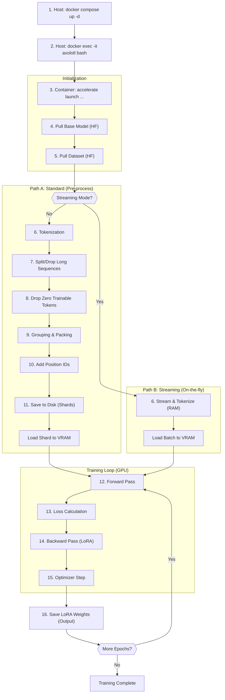
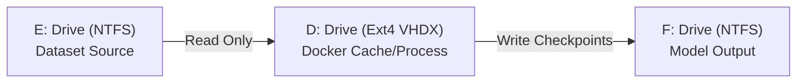

# Axolotl Training Workflow

This document describes the lifecycle of a training run using Axolotl within the Docker environment.

## 🔄 Workflow Overview




## 📋 Detailed Steps

### 1. Environment Startup
Running `docker compose up -d` creates a persistent environment.
- **Volumes**: Your `configs`, `dataset`, and `output` folders are mounted.
- **Sleep Infinity**: The container stays idle until you give it a command.

### 2. Enter the Container
Connect to the running container's shell:
```bash
docker compose exec axolotl bash
cd /workspace
```

### 3. Execution (Accelerate)
We use `accelerate launch` to start the training. This wrapper handles multi-GPU (if any) and distribution.
```bash
accelerate launch -m axolotl.cli.train configs/code-training.yaml
```

### 4. Data & Model Pulling
- **Hugging Face**: Axolotl uses your `HUGGINGFACE_TOKEN` to authenticate.
- **Caching**: Models are stored in the internal cache. If you restart the container, they persist as long as the volume is maintained.

### 4.1 Data Pipeline (Two Paths)

Depending on your configuration, Axolotl uses one of two paths:

#### Path A: Standard (Pre-process)
*Best for workstations (128GB+ RAM) or small datasets (<10GB).*
1.  **Tokenization**: Converting raw text (Code) into numbers (Tokens).
2.  **Split/Drop Long Sequences**: Longer files are split; zero-training chunks are dropped.
3.  **Group & Pack (Critical Step)**:
    -   **What**: Stitches multiple short sequences into one long 4096 sequence to maximize GPU usage.
    -   **Requirement**: Must read the *entire* dataset to calculate lengths.
4.  **Save to Disk (Shards)**:
    -   **Result**: Huge `.arrow` files in `cache/`.
    -   **Benefit**: Fastest training speed (packed) and instant resume.
    -   **Risk**: High RAM/Disk usage during preparation.

#### Path B: Streaming (On-the-fly)
*Best for consumer PCs (64GB RAM) or massive datasets (The Stack).*
-   **Config**: `streaming: true` + `sample_packing: false`.
-   **Process**:
    1.  Downloads/Streams data chunk-by-chunk from Hugging Face.
    2.  Tokenizes in RAM just before the GPU needs it.
    3.  **No Packing**: Sequences are padded to 4096 (less efficient than packing, but stable).
-   **Benefit**: Starts training instantly. Zero disk I/O crashes.
-   **Trade-off**: Slightly slower training due to padding overhead.

### 5. Training Phase
- **QLoRA**: The base model (e.g., Qwen 32B) is frozen in 4-bit. Only the tiny "LoRA adapters" are trained.
- **Monitoring**: Look for `loss` in the logs. If loss decreases, the model is learning!
- **Checkpoints**: Every 1 epoch (or as configured), a new adapter folder is created in your `output` directory.

### 6. Post-Training
Once finished, you will have a directory containing:
- `adapter_model.bin` (or `.safetensors`)
- `adapter_config.json`
- `tokenizer.json`

These files represent the "delta" between the original Qwen and your specialized coding model.

## 🐞 Debug Workflow (Qwen Coder)

To quickly verify your setup without running a full training (which can take hours), use the localized debug configurations.

### 1. Run Debug Training
This uses a tiny subset of data to test the pipeline (tokenization, packing, training loop).

```bash
docker compose exec axolotl accelerate launch -m axolotl.cli.train /workspace/configs/code-training-debug.yaml
```

### 2. Merge LoRA Adapters
Once debug training is complete, merge the LoRA adapters back into the base model to create a standalone model.

```bash
docker compose exec axolotl accelerate launch -m axolotl.cli.merge_lora /workspace/configs/code-merge-debug.yaml
```

### 3. Export to Ollama
After merging, you can create a local Ollama model to test inference.

**Note for Windows (Git Bash) Users**:
Git Bash may auto-convert Linux paths (e.g., `/models/...`) to Windows paths (`C:/Program Files/...`), breaking the command inside Docker. To fix this, prefix the path with `//`.

```bash
# Create the model using the debug Modelfile
docker compose exec ollama ollama create qwen-coder-debug -f //models/Modelfile.debug
```

**Modelfile.debug contents**:
```dockerfile
FROM /models/qwen-1.5b-merged/merged
TEMPLATE """{{ if .System }}<|im_start|>system
{{ .System }}<|im_end|>
{{ end }}{{ if .Prompt }}<|im_start|>user
{{ .Prompt }}<|im_end|>
{{ end }}<|im_start|>assistant
"""
PARAMETER stop "<|im_start|>"
PARAMETER stop "<|im_end|>"
```

## 🛠️ Troubleshooting

### 1. "ls: cannot access ... No such file or directory"
- **Cause**: You are likely in the wrong directory inside the container.
- **Fix**: Run `cd /workspace` before running any commands.
- **Check**: Run `ls configs/` to verify the volume is mapped correctly.

### 2. "requirement error: unsatisfied condition: cuda>=12.8"
- **Cause**: Your host NVIDIA driver is too old for the `main-latest` image.
- **Fix**: Update your `docker-compose.yml` image tag to a compatible version (e.g., `axolotlai/axolotl:main-py3.11-cu124-2.6.0`).

### 3. "GatedRepoError" or "Gated Dataset" access denied
- **Cause**: You haven't accepted the terms for the dataset on the Hugging Face website.
- **Fix**: Visit [bigcode/the-stack](https://huggingface.co/datasets/bigcode/the-stack), log in, and click "Agree and access repository".

### 4. Out of Memory (OOM) on RTX 4090
- **Cause**: Trying to train 32B model with large context or batch size.
- **Fix**: In your configuration YAML:
    - Set `micro_batch_size: 1`
    - Set `sequence_len: 4096` (or lower)
    - Ensure `gradient_checkpointing: true`
    - Use `optimizer: paged_adamw_8bit`

### 5. "SystemError: unknown opcode" or "SIGSEGV" (Windows/WSL)
- **Cause**: High-performance "Memory Mapping" (mmap) operations on NTFS drives mounted via WSL (e.g., E:/ or F:/) are unstable.
- **Fix**: Move the cache to a native Linux path inside the container (which resides on the D: drive's VHDX).
- **Config**: Set `dataset_prepared_path: /workspace/cache/...` in `code-training.yaml`.

## 🏗️ Storage Architecture (IO Separation)

To maximize performance and stability on Windows/WSL with 2x 4TB NVMe drives, we use a "Pipeline" architecture:



| Role | Drive | Path | File System | Notes |
| :--- | :--- | :--- | :--- | :--- |
| **Source** | **E:** | `/workspace/dataset` | NTFS (Mounted) | Safe for sequential reading. |
| **Process** | **D:** | `/workspace/cache` | Ext4 (Internal) | **Critical** for stability (mmap). Speed: NVMe. |
| **Output** | **F:** | `/workspace/output` | NTFS (Mounted) | Safe for sequential writing. |

## 🛠️ Performance Optimization

For details on how to run massive models (e.g., 32B) on consumer hardware with limited RAM/VRAM, see the dedicated guide:

[Optimization Guide: Training 32B Models on Consumer Hardware](./optimization-guide.md)
