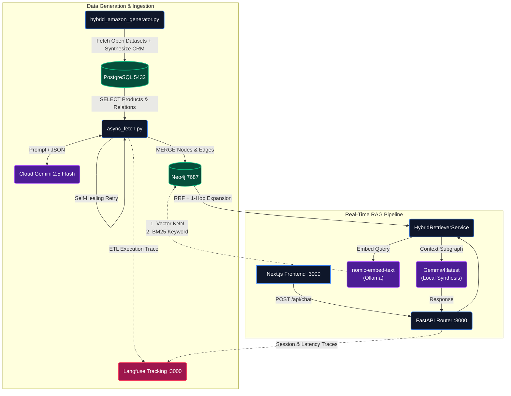
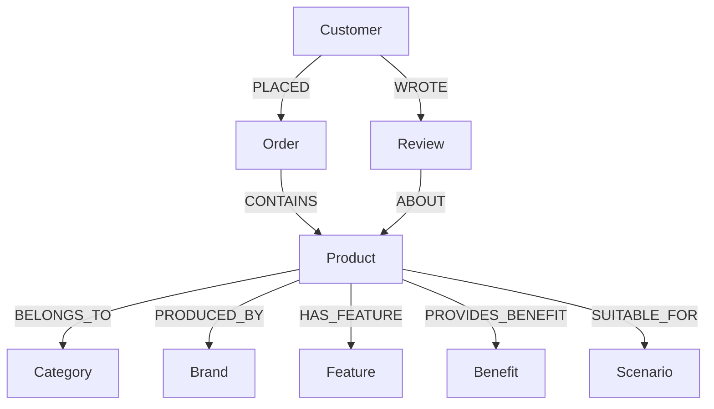
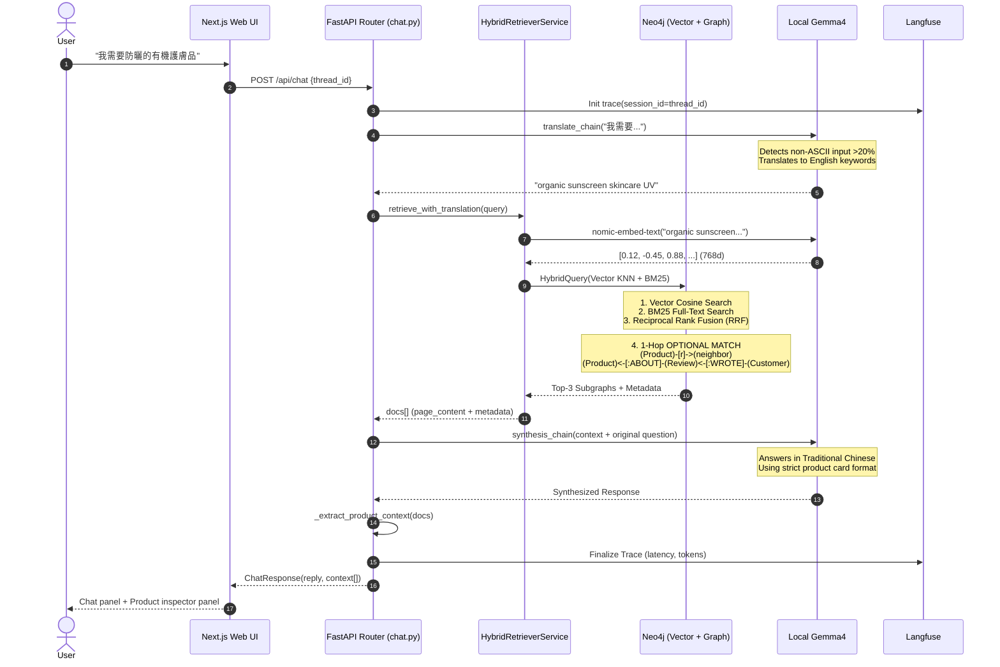
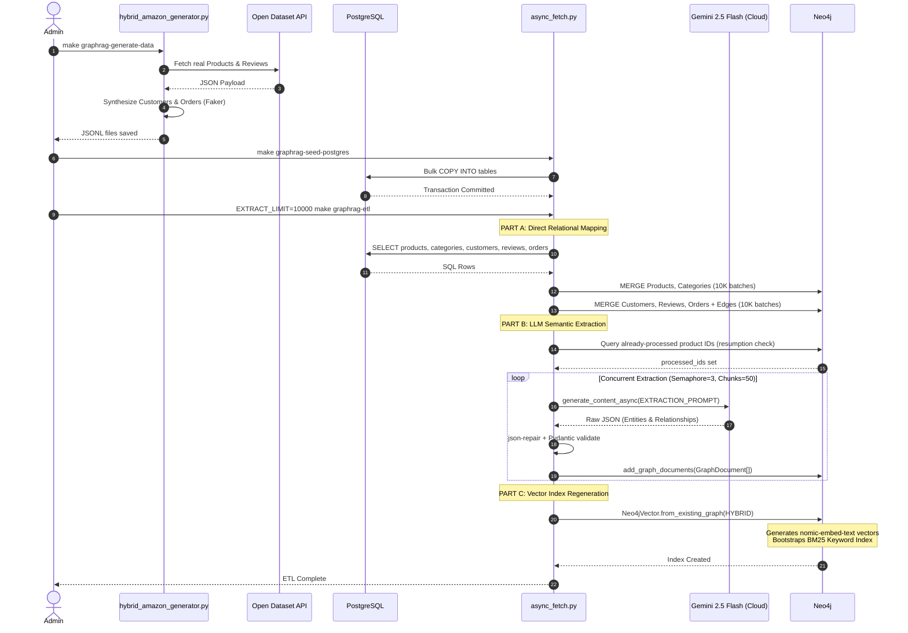

# GraphRAG E-Commerce Architecture

This document describes the production-grade Hybrid GraphRAG E-Commerce system. It covers the dual-database infrastructure, asynchronous ETL pipeline, real-time query mechanics, and graph ontology.

> [!NOTE]
> For the higher-level Enterprise system overview (covering Phase 12 & 13), see [enterprise-graphrag/architecture.md](../enterprise-graphrag/architecture.md).
> For Neo4j operational commands and backup procedures, see [neo4j/operations.md](../neo4j/operations.md).

---

## 1. System Topology & Data Flow

The system operates across two layers linked by an asynchronous ETL ingestion pipeline:

- **Primary Transactional Layer (ACID)**: PostgreSQL (`pgvector`) — Source of Truth for products, categories, customers, orders, and reviews.
- **Knowledge Retrieval Layer (Graph & Vector)**: Neo4j — Semantic Retrieval Engine for vector searches, BM25 keyword matches, and multi-hop Cypher traversals.
- **Observability Layer (Telemetry)**: Langfuse — Distributed tracing capturing LLM latency, chunk retrieval, token usage, and session management.



---

## 2. Infrastructure

All data stores are managed via a single Docker Compose file:

- **Compose File**: `deployments/docker-compose/graphrag-ecommerce/docker-compose.yml`
- **Start**: `make graphrag-db-up`
- **Stop**: `make graphrag-db-down`

### Databases

| Service               | Container           | Port        | Volume                     | Purpose                   |
| --------------------- | ------------------- | ----------- | -------------------------- | ------------------------- |
| PostgreSQL (pgvector) | `graphrag-postgres` | 5432        | `pg-data`                  | ACID Source of Truth      |
| Neo4j + APOC          | `graphrag-neo4j`    | 7474 / 7687 | `neo4j-data`, `neo4j-logs` | Semantic Retrieval Engine |

### Local AI Models (Ollama)

| Model                    | Role                     | Invocation                                   |
| ------------------------ | ------------------------ | -------------------------------------------- |
| `gemma4:latest`          | LLM Synthesis (QA chain) | `ChatOllama(model="gemma4:latest")`          |
| `nomic-embed-text`       | Vector Embeddings (768d) | `OllamaEmbeddings(model="nomic-embed-text")` |
| Gemini 2.5 Flash (Cloud) | ETL Knowledge Extraction | `genai.GenerativeModel("gemini-2.5-flash")`  |

### Observability Stack (External)

| Service               | Container           | Port        | Purpose                   |
| --------------------- | ------------------- | ----------- | ------------------------- |
| Langfuse Server       | `langfuse-server`   | 3000        | Telemetry Dashboard UI    |

> **Note**: The Langfuse stack is managed independently under `deployments/docker-compose/langfuse/docker-compose.yml`. E-Commerce services integrate with it via environment variables if available.

---

## 3. Graph Ontology

### Node Labels

| Label      | Source              | Examples                      |
| ---------- | ------------------- | ----------------------------- |
| `Product`  | PostgreSQL (direct) | Camping Tent, Sunscreen SPF50 |
| `Category` | PostgreSQL (direct) | Outdoor Gear, Health & Beauty |
| `Customer` | PostgreSQL (direct) | Synthetic CRM entities        |
| `Order`    | PostgreSQL (direct) | Purchase transactions         |
| `Review`   | PostgreSQL (direct) | Customer ratings & comments   |
| `Brand`    | LLM Extraction      | Arc'teryx, CeraVe             |
| `Feature`  | LLM Extraction      | Waterproof, Organic           |
| `Benefit`  | LLM Extraction      | UV Protection, Pain Relief    |
| `Scenario` | LLM Extraction      | Climbing, Daily Skincare      |

### Relationship Types

| Relationship       | Source → Target    | Origin                      |
| ------------------ | ------------------ | --------------------------- |
| `BELONGS_TO`       | Product → Category | PostgreSQL (direct mapping) |
| `PRODUCED_BY`      | Product → Brand    | LLM Extraction              |
| `HAS_FEATURE`      | Product → Feature  | LLM Extraction              |
| `PROVIDES_BENEFIT` | Product → Benefit  | LLM Extraction              |
| `SUITABLE_FOR`     | Product → Scenario | LLM Extraction              |
| `PLACED`           | Customer → Order   | PostgreSQL (direct mapping) |
| `CONTAINS`         | Order → Product    | PostgreSQL (direct mapping) |
| `WROTE`            | Customer → Review  | PostgreSQL (direct mapping) |
| `ABOUT`            | Review → Product   | PostgreSQL (direct mapping) |

### Schema Visualization



---

## 4. Real-Time Query Sequence

When a user submits a natural language question, the system executes the following pipeline:



### Key Design Decisions

- **CJK Translation Routing**: `nomic-embed-text` is English-only. Non-ASCII queries (>20% non-ASCII characters) are first translated to English keywords via `Gemma4`, then used for retrieval. English queries bypass translation entirely (~500ms latency savings).
- **Hybrid Search (RRF)**: Combines Vector KNN (semantic similarity) and BM25 (keyword matching) via Reciprocal Rank Fusion for better recall than either method alone. The candidate retrieval depth is intentionally elevated (`k=1000`) to overcome heavy topological redundancy in the synthetic dataset, guaranteeing that the LLM receives diverse, distinct base products for deduplicated UI rendering.
- **1-Hop Graph Expansion**: After finding anchor Product nodes, the retriever expands 1 hop to pull associated Features, Benefits, Reviews, and Customer sentiments into the context window.
- **Structured Response**: The LLM is constrained to output in a strict `Key: Value` product card format with Markdown image syntax, enabling the frontend to render a split-screen layout (chat panel + product inspector panel).

---

## 5. ETL Pipeline

### Self-Healing Mechanisms

| Mechanism           | Library                                    | Purpose                                                      |
| ------------------- | ------------------------------------------ | ------------------------------------------------------------ |
| Concurrency Control | `asyncio.Semaphore(3)`                     | Prevent API rate limit exhaustion                            |
| Retry with Backoff  | `tenacity` (3 attempts, exponential 4–30s) | Survive transient network failures                           |
| JSON Auto-Repair    | `json_repair`                              | Salvage malformed LLM JSON output before Pydantic validation |
| Cost Protection     | `EXTRACT_LIMIT` env var                    | Cap LLM API calls during development                         |
| Resumption Safety   | Neo4j edge query                           | Skip products already extracted on restart                   |
| Batch Chunking      | 50-doc chunks with `asyncio.gather`        | Prevent coroutine explosion on 100K+ records                 |

### ETL Sequence



---

## 6. Backend Module Map

```
backend/ecommerce-graphrag/
├── main.py                          # FastAPI app (port 8000)
├── api/routes/chat.py               # POST /api/chat endpoint
├── core/
│   ├── config.py                    # Settings (YAML parsing, env injection)
│   ├── database.py                  # Neo4j + PostgreSQL connections
│   └── llm.py                       # Gemma4 (synthesis) + nomic-embed-text (embeddings)
├── services/
│   └── retriever_service.py         # HybridRetrieverService (Vector + BM25 + Graph)
├── schemas/
│   └── chat_schema.py               # ChatRequest / ChatResponse (Pydantic)
└── ingestion/
    ├── async_fetch.py               # Main ETL pipeline (Part A/B/C)
    ├── ontology.py                  # Ontology definitions
    └── seed_mock_graph.py           # Legacy mock seeder
```

---

## 7. Makefile Quick Reference

| Command                        | Description                                        |
| ------------------------------ | -------------------------------------------------- |
| `make graphrag-db-up`          | Start PostgreSQL + Neo4j containers                |
| `make graphrag-db-down`        | Stop containers                                    |
| `make graphrag-generate-data`  | Generate 100K retail product JSONL                 |
| `make graphrag-seed-postgres`  | Bulk load JSONL → PostgreSQL                       |
| `make graphrag-etl`            | Run ETL: PG → Neo4j (EXTRACT_LIMIT controls scope) |
| `make graphrag-rebuild`        | Clean Neo4j → full ETL                             |
| `make graphrag-backend-dev`    | Start FastAPI on port 8000                         |
| `make graphrag-frontend-dev`   | Start Next.js on port 3000                         |
| `make graphrag-neo4j-clean`    | Wipe all Neo4j data                                |
| `make graphrag-postgres-clean` | Wipe all PostgreSQL tables                         |
| `make graphrag-clean-all`      | Full wipe (Neo4j + PG + JSONL)                     |
| `make graphrag-verify`         | Run end-to-end topology health check               |

---

## 8. Implementation Notes

- The **Next.js frontend** renders a split-screen layout: left panel for chat, right panel for structured product cards with images and prices.
- The **FastAPI backend** extracts structured product data from retriever documents (`_extract_product_context`) and returns it alongside the LLM's conversational reply.
- The **synthesis LLM** (Gemma4) is constrained via system prompt to answer in **Traditional Chinese (繁體中文)**, using a strict product card format that the frontend can reliably parse.
- The **embedding model** (nomic-embed-text) runs locally via Ollama, eliminating dependency on cloud embedding APIs.
- The **ETL pipeline** supports both **cloud** (Gemini 2.5 Flash) and **local** (Gemma4 via Ollama) LLM providers, controlled by the `ETL_LLM_PROVIDER` setting in `config.yaml`.
- **Configuration Management**: The system utilizes a structured `config.yaml` instead of legacy `.env` files. `core/config.py` acts as a translation layer, loading YAML boundaries (server, db, observability) and dynamically populating `os.environ` to satisfy standard Python SDKs seamlessly.
- **Observability Integration (v4 SDK)**: Tracing is powered by the Langfuse Python SDK v4 (`from langfuse import observe, get_client`). Decorators capture execution context, and ETL operations log custom I/O via `get_client().update_current_generation()`.
