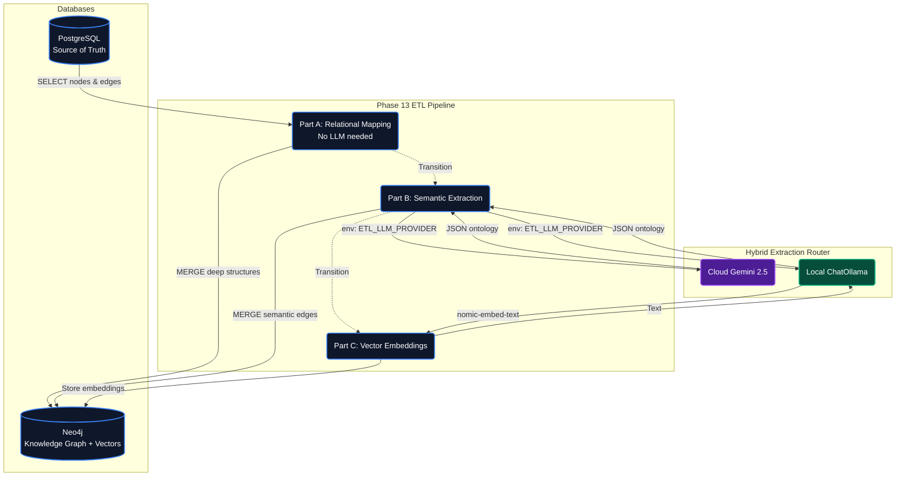

# Enterprise GraphRAG Operations (Phase 13)

This document describes how to execute the Dual-Database system components and data pipelines introduced in Phase 13.

## 1. Database Operations (PostgreSQL + Neo4j)

Start the unified data cluster (pgvector & Neo4j) using the root Makefile:

```bash
make graphrag-db-up
```

> **Note**: If you encounter a `Conflict` error (e.g., container already in use), forcefully remove your legacy Phase 10/11 containers first:
> `docker rm -f graphrag-neo4j langgraph-postgres`

Stop the dual-database cluster:

```bash
make graphrag-db-down
```

- **Neo4j Admin Browser**: `http://localhost:7474` (Defaults: `neo4j` / `password`)
- **PostgreSQL**: `localhost:5432` (Defaults: `postgres` / `password` / Schema: `ecommerce`)

## 2. Dynamic Retail Data Generation (Phase 13 Hybrid Engine)

Generate the highly-relational Retail Dataset locally using the unified Python Data Generator, which synthesizes Combinatorial Products alongside deterministic Customers, Reviews, and Invoices.

```bash
# Default enterprise generation (100,000 Products, 20k Customers, 60k Reviews)
make graphrag-generate-data

# Fast local test generation (1,000 Products, 200 Customers, 600 Reviews)
DATA_SCALE=1000 make graphrag-generate-data
```

_Outputs are streamlined into `.jsonl` files located at `scripts/ecommerce-graphrag/data/`._

> [!NOTE]
> **Real-World Amazon Injection & Reverse-Synthesis**
> In Phase 13, we completely deprecated the Node.js mock data generator.
> The generation now strictly leverages real Amazon Product schemas blended with Faker-based reverse-synthesis to generate perfectly bounded mock `Customers`, `Orders`, and `Reviews`.

## 3. Full Pipeline Execution (Recommended Order)

### A. Seed PostgreSQL (Very fast, ~5s via psycopg COPY):

```bash
make graphrag-seed-postgres
```

_Note: This strictly inherits the chunk size originally pushed by `DATA_SCALE` generation._

### B. Run Graph Knowledge Extraction (ETL):

Transforms SQL relations into Graph edges. We now support dynamic LLM routing (`ETL_LLM_PROVIDER`) to avoid rate limits natively.

```bash
# Execute ETL using local Ollama model (gemma4:latest) -- $0 Cost
make graphrag-etl

# Execute ETL using Google Gemini -- faster, requires GOOGLE_API_KEY
ETL_LLM_PROVIDER=gemini make graphrag-etl
```

**Safety Lock**: If your `DATA_SCALE` is <= 2500, the ETL process assumes it's a test environment and natively extracts ALL nodes. If your scale exceeds 2500, it artificially enforces a limit of 25 nodes to prevent massive token burn or multi-hour operations on your machine. You can override this explicitly:

```bash
EXTRACT_LIMIT=100000 make graphrag-etl
```

### C. Automatic Health Verification:

Verify the cross-database boundaries immediately after ETL generation. Ensures `Customer`/`Review` constraints and matching topological nodes.

```bash
make graphrag-verify

# Option: Test a specific target threshold
VERIFY_SCALE=1000 make graphrag-verify
```

### D. Cleanup Targets:

```bash
make graphrag-neo4j-clean    # Wipe only Neo4j nodes and indexes
make graphrag-postgres-clean # Wipe only PostgreSQL tables
make graphrag-data-clean     # Delete generated .jsonl data files
make graphrag-clean-all      # Master cleanup: wipe ALL databases and generated files
```

## 4. Launching the End-to-End Application

The application consists of a FastAPI Retrieval Backend (acting as our Neo4j Hybrid Search Retriever) and a Next.js Client Layer.

**Start the Backend API**:

```bash
make graphrag-backend-dev
```

API Documentation: `http://localhost:8000/docs`

**Start the Frontend**:

```bash
make graphrag-frontend-dev
```

Client UI: `http://localhost:3000`

## 5. ETL Pipeline Architecture

### Dynamic Fallback Strategy

The ETL pipeline routes based on environment definitions:

| Phase                         | Provider Route       | Location | Speed                  |
| :---------------------------- | :------------------- | :------- | :--------------------- |
| **Part A** (Structural Edges) | None (Pure Cypher)   | Local    | ~15s for 100k nodes    |
| **Part B** (Semantic Nodes)   | `ollama` (gemma4)    | Local    | ~3–5s per product ($0) |
| **Part B** (Semantic Nodes)   | `gemini` (Flash 2.5) | Cloud    | ~1s per product        |
| **Part C** (Embeddings)       | `nomic-embed-text`   | Local    | ~0.1s per product      |

### Safety Mechanisms

1. **Schema Constraints**: `CREATE CONSTRAINT` on Neo4j for `product_id`, `category_id`, `customer_id`, and `review_id` ensures O(log N) lookup during nested deep relationships (`c-[:WROTE]->rev-[:ABOUT]->p`).
2. **pg_id as Universal Primary Key**: PostgreSQL integer ID is used natively as the definitive `Node.id` in Neo4j, completely preventing title-matching collisions.
3. **Array Sanitization (Cypher Reducers)**: LLM strings bound deeply to graph structures (like Reviews embedded recursively) are safely rendered using Cypher `reduce` blocks to prevent string initialization crashes inside Langchain retrieving logic (`ValueError: text column None`).
4. **Resumable Contexts**: On restart, the script structurally queries Neo4j for products with existing semantic edges via relationship comparisons (`type(r) <> 'BELONGS_TO'`) and skips them natively.



## 6. Estimated Execution Operations

| Operation                     | Scale Constraint       | Provider | Est. Time | Est. Cost |
| :---------------------------- | :--------------------- | :------- | :-------- | :-------- |
| `make graphrag-generate-data` | `DATA_SCALE=100000`    | Python   | ~5s       | $0        |
| `make graphrag-generate-data` | `DATA_SCALE=1000`      | Python   | < 1s      | $0        |
| `make graphrag-etl` (Part B)  | `EXTRACT_LIMIT=1000`   | `ollama` | ~1 hour   | $0        |
| `make graphrag-etl` (Part B)  | `EXTRACT_LIMIT=100000` | `gemini` | ~45 min   | ~$5       |
| `make graphrag-verify`        | `VERIFY_SCALE=1000`    | Python   | ~1s       | $0        |
