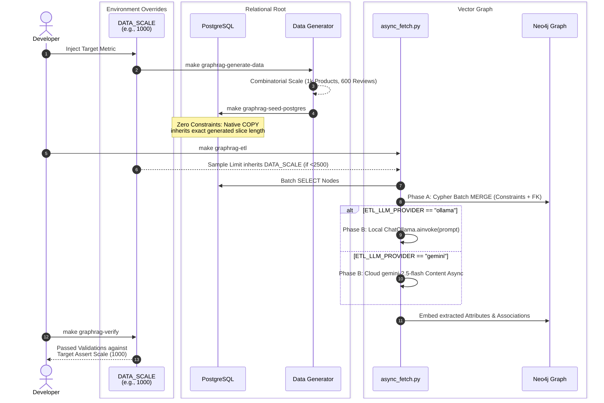
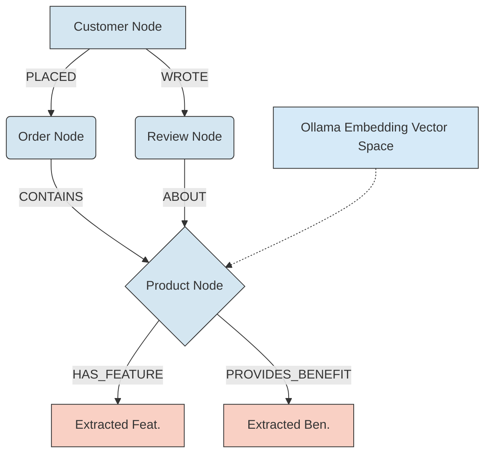

# Phase 13 Release Notes: Hybrid Data Engine & Environment Scalability

**Release Date:** April 2026  
**Status:** ✅ Successfully Deployed to `llm-playground`

---

## 📌 Executive Summary

Phase 13 introduces a complete architectural overhaul to the data layer of the Enterprise GraphRAG system. By retiring fixed-scale Node.js synthetic data generators, the system now adopts a dynamic, Python-native backend capable of generating precisely scaled, real-world Amazon dummy datasets (via Combinatorial Amplification). 

In tandem, this release delivers critical enterprise functionalities:
- **Global Scaling**: Introduction of the `DATA_SCALE` environment boundary controlling Data Generation, PostgreSQL Injection, and LLM Extraction capacities from 1k through 100k nodes instantly.
- **Local Fallback Execution**: Implementing deterministic LLM API fallbacks (`ETL_LLM_PROVIDER=ollama`) to securely bypass API token limits using local intelligence structures.
- **Enterprise Verification Pipeline**: An automated verification skill seamlessly cross-referencing Relational constraints against Neo4j knowledge edges.

---

## 🔎 Pipeline Verification (`make graphrag-verify`)

To ensure absolute topological consistency across databases, Phase 13 implements a programmatic Health Check protocol that validates data integrity without needing manual Cypher tests.

### Verification Capabilities
- **Dynamically Scaled Validations**: By inherently reading `VERIFY_SCALE` (inherited from `DATA_SCALE`), the script strictly bounds expectations. If `DATA_SCALE=1000`, the script expects ~1,000 Products and ~600 Reviews in Neo4j, failing loudly if data offsets occur.
- **Cross-Database Integrity**: The protocol independently accesses PostgreSQL and validates that `category_id` maps cleanly without a single exception (`FK Integrity 100%`), guaranteeing a pristine extraction floor before hitting the Vector DB.
- **Neo4j Edge Completeness**: Validates that both Structural Deep Edges (`(Customer)-[:PLACED]->(Order)`) and Semantic Constraints (`UNIQUE` boundaries on IDs) successfully spawned inside the Neo4j Graph schema.

---

## 🏗️ Architecture & Sequence Visualization

### 1. Unified GraphRAG ETL Scaling Flow
The following sequence demonstrates how `DATA_SCALE` unifies the components spanning relational injection through to LLM Semantic extraction.

### 2. Multi-Hop GraphRAG Architecture
By bypassing one-hop limitations, the Retriever natively joins Deep PostgreSQL mapping into LLM-accessible Cypher bounds (`retriever_service.py`):

*Note: Blue Nodes correspond directly to deterministic PostgreSQL boundaries (`Part A` ETL mapping). Red Nodes represent semantically extracted relationships built by Gemini/Ollama (`Part B` ETL generation).*
