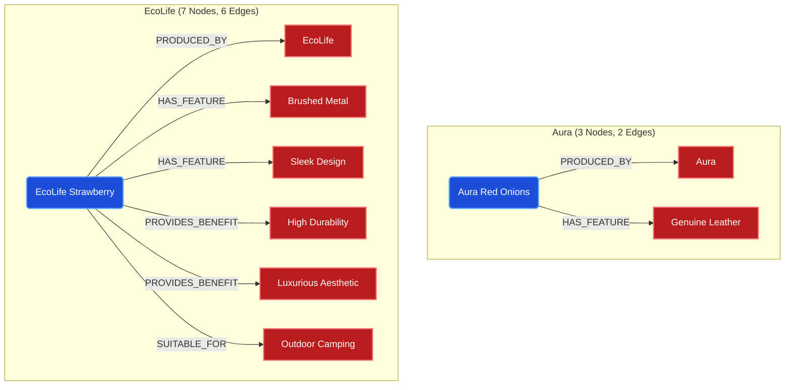

# Demystifying Semantic Extraction: Nodes & Edges

When running the Enterprise GraphRAG ETL pipeline (`make graphrag-etl`), specifically during **Part B (Semantic Extraction)**, you will observe terminal output similar to this:

```text
=> [SUCCESS]: Aura Modern Red Onions (Genuine Leather Edition) (3 nodes, 2 edges)
=> [SUCCESS]: EcoLife Sleek Strawberry (Brushed Metal Edition) (7 nodes, 6 edges)
=> [SUCCESS]: Vanguard Premium Decoration Swing (Aerospace Aluminum Edition) (4 nodes, 3 edges)
```

Many engineers initially wonder: *Why do the numbers fluctuate? Are there missing numbers?*

The answer is **No**. The fluctuating numbers are not errors; they represent the core technological advantage of Large Language Models (LLMs) building a dynamic Knowledge Graph.

---

## 1. What are "Nodes" and "Edges"?

During Part B of the ETL process, a Language Model (either `Gemma 4` locally or `Gemini 2.5` in the cloud) meticulously reads the raw textual `description` of every product. It then atomizes that text into structured ontological components.

### 🔵 Nodes (The Concepts)
Nodes represent the individual **Conceptual Entities** that the LLM discovered within the text.
- Example Node Types: `Product`, `Feature`, `Benefit`, `Scenario`, `Brand`.
- If a product description mentions *"This laptop is waterproof and great for outdoor camping"*, the LLM will spawn 3 Nodes:
  1. `Laptop` (Product)
  2. `Waterproof` (Feature)
  3. `Outdoor Camping` (Scenario)

### 🔴 Edges (The Connections)
Edges represent the directional **Relationships** that connect the Nodes together.
- Example Edge Types: `HAS_FEATURE`, `SUITABLE_FOR`, `PROVIDES_BENEFIT`.
- Following the previous example, the LLM will draw 2 Edges:
  1. `[Laptop]` -> `(HAS_FEATURE)` -> `[Waterproof]`
  2. `[Laptop]` -> `(SUITABLE_FOR)` -> `[Outdoor Camping]`
- Hence, that specific extraction results in **(3 nodes, 2 edges)**.

---

## 2. Why is the Extraction "Asymmetric"?

In a traditional Relational Database (SQL), every row in a table is rigid. If a table has 10 columns, a product with only 2 known attributes still occupies 10 columns (leaving 8 as `NULL`).

A **Knowledge Graph**, however, is inherently **asymmetric and organic**:
- **Information Density dictates Graph Size**: 
  - `Aura Modern Red Onions (3 nodes, 2 edges)`: The description was likely short or focused on a single trait (e.g., stating only the brand and the primary material). The LLM extracts exactly what it sees.
  - `EcoLife Sleek Strawberry (7 nodes, 6 edges)`: The text contained a dense sequence of marketing claims, material specifications, and usability scenarios. The LLM intelligently fragmented it out into 6 distinct interconnected features/benefits radiating from the central product node.

### Visual Example: Asymmetric Scale



## 3. Why This Matters for GraphRAG

If you want to understand why GraphRAG can answer complex queries better than traditional Vector DBs, look no further than this exact metric.

When a user asks the UI: *"I need something for outdoor camping that is waterproof"*
1. **Vector-Only Search**: Relies solely on mathematical distance matching.
2. **GraphRAG Search**: The Retriever traces the explicit `(SUITABLE_FOR)` and `(HAS_FEATURE)` edges created during this exact phase. Because the LLM structurally separated the concepts during ingestion, the retrieval engine can deterministically cross-reference the nodes matching user intent without hallucination.

The varying counts of `(X nodes, Y edges)` validate that your ETL pipeline is successfully reading, interpreting, and organically reshaping flat text into a living, multi-dimensional knowledge network.
