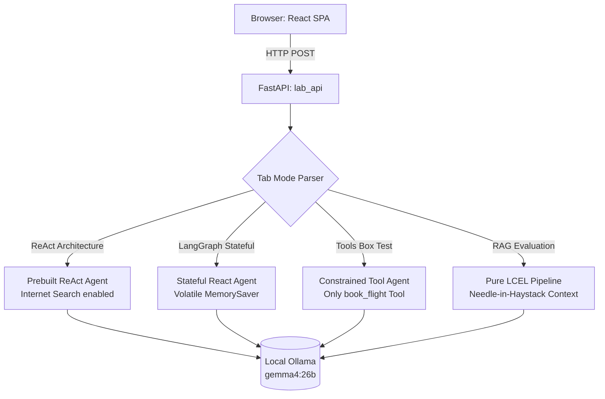

# LangChain Test Lab Architecture

## Overview
The LangChain Test Lab (Phase 06) is a frontend-backend bridging system designed to evaluate routing behavior across different distinct Agent brains. It utilizes an identical Vite/React UI wrapper over dynamically selected endpoints.

## Agent Dispatch Flow

## System Interfaces
- **Frontend State**: Each tab utilizes an independent UUID payload (`thread_id`) but relies on the UI's internal `activeTab` memory block to decouple sessions cleanly.
- **Backend Handlers**: Each mode explicitly launches an independent `StateGraph` compilation without persistent checkpointers to provide isolated unit-testing metrics.

## Runtime Sequence Flow (Trace & Stream)

```mermaid
sequenceDiagram
    participant UI as React Frontend
    participant API as FastAPI (lab_api)
    participant LangChain as LCEL / Agent Executor
    participant Ollama as Local Gemma4
    participant Langfuse as Langfuse

    UI->>API: HTTP POST /api/langchain/stream ({"tab", "task"})
    activate API
    API->>LangChain: Compile & astream_events()
    activate LangChain
    
    LangChain->>Ollama: Generate reasoning
    activate Ollama
    
    rect rgb(30, 40, 50)
        Note over LangChain,Langfuse: Observability Boundary
        LangChain-->>Langfuse: Intercept & Push Trace Spans via CallbackHandler
    end
    
    Ollama-->>LangChain: Token chunk
    LangChain-->>API: Yield chunk
    API-->>UI: SSE Event (data: chunk\n\n)
    
    Ollama->>LangChain: finish_reason / Action Complete
    deactivate Ollama
    LangChain-->>API: Final execution state
    deactivate LangChain
    API-->>UI: SSE Event ([DONE] marker)
    deactivate API
```

### Flow Description
* **FastAPI Endpoint (`/api/langchain/stream`)**: Serves as the real-time bridge. It translates standard HTTP POST payload requests into Server-Sent Events (SSE) by wrapping the LangChain `astream_events()` async generator. This produces the "typewriter" effect on the React UI.
* **Observability Boundary**: A critical layer that automatically intercepts internal LLM invocations, token usage calculations, and internal pipelining events. Based on the `observability.backend` toggle in `config.yaml`, it pushes traces asynchronously to the local Langfuse server (via `CallbackHandler`) or Arize Phoenix (via `OTLPSpanExporter`).
* **Streaming Constraints**: Because the LLM (Ollama / Gemma 4) streams individual token chunks, the FastAPI server pushes them down the wire instantly (`data: chunk\n\n`). Wait times are restricted strictly to raw inference latency, enabling highly responsive UI.

### Design Principles & Rationale
1. **Unidirectional Data Flow (SSE over WebSockets)**: For generative AI inferencing, the communication strictly flows Server-to-Client once the initial prompt is submitted. Server-Sent Events (SSE) provide a lighter-weight, native HTTP/1.1 compatible stream that avoids the complex state-management and reconnection overhead of bidirectional WebSockets.
2. **Stateless API, Stateful Client**: The LangChain LCEL pipelines exposed here do not inherently store conversation history in a database. Scaling is achieved by enforcing UI components (React) to maintain context and pass it incrementally, ensuring the `lab_api` remains stateless and horizontally scalable.
3. **Decoupled Observability**: Applying the Aspect-Oriented Programming (AOP) paradigm, `LangChainInstrumentor` patches the base classes dynamically. The core LLM routing logic remains completely unpolluted by tracing code; telemetry strictly operates as a non-intrusive sidecar.
