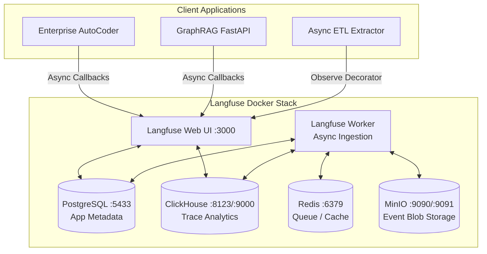
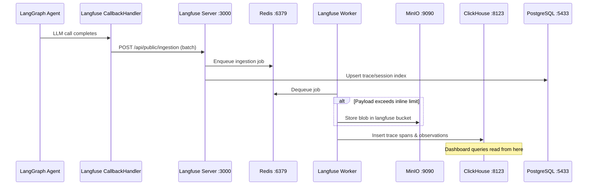

# Langfuse Observability Architecture

## Overview
The Langfuse telemetry stack is introduced in Phase 16 as the primary local, privacy-first observability platform for the Enterprise AutoCoder (Phase 15), and expanded in Phase 17 to cover the E-Commerce GraphRAG system and asynchronous ETL pipelines. Langfuse provides complete coverage of LangGraph cycles and LangChain runnables, separating distinct LLM logic and retrieval fetches into readable hierarchical sub-graphs and spans.

## Component Topology

## Infrastructure Component Roles

### PostgreSQL (port `5433` → internal `5432`)
- **Image**: `postgres:15`
- **Role**: Primary relational data store for Langfuse application metadata. Stores:
  - User accounts, projects, and API key configurations
  - Prompt management versions and evaluation definitions
  - Session and trace index records (lightweight references; heavy payloads live in ClickHouse)
- **Volume**: `langfuse_db_data` → `/var/lib/postgresql/data`
- **Why port 5433**: Avoids collision with the LangGraph/pgvector PostgreSQL instance already running on `5432`.

### ClickHouse (ports `8123` HTTP, `9000` native TCP)
- **Image**: `clickhouse/clickhouse-server`
- **Role**: Columnar OLAP engine optimized for high-throughput analytical queries on trace data. Stores:
  - All raw trace spans, observations, and generation events
  - Token usage metrics, latency histograms, and cost calculations
  - Powers the Langfuse dashboard charts, filtering, and aggregation queries
- **Volume**: `langfuse_clickhouse_data` → `/var/lib/clickhouse`
- **Why ClickHouse**: Langfuse v3 migrated from PostgreSQL-only storage to a ClickHouse hybrid to handle millions of trace events with sub-second query performance.

### Redis (port `6379`)
- **Image**: `redis:7`
- **Role**: In-memory message broker and cache layer. Handles:
  - Job queue for the `langfuse-worker` async ingestion pipeline (buffered trace writes)
  - Rate limiting and deduplication of incoming SDK events
  - Session cache for the Langfuse Web UI (NextAuth sessions)
- **Volume**: `langfuse_redis_data` → `/data`
- **Auth**: Password-protected (`myredissecret`)

### MinIO (ports `9090` API, `9091` console)
- **Image**: `minio/minio`
- **Role**: S3-compatible object storage for large event payloads. Handles:
  - Blob storage for oversized trace inputs/outputs that exceed ClickHouse inline limits
  - Event upload staging bucket (`langfuse`) used by both Server and Worker
  - Media attachments and exported dataset files
- **Volume**: `langfuse_minio_data` → `/data`
- **Console**: Accessible at `http://localhost:9091` (user: `minio`, password: `miniosecret`)

## Trace Data Flow

## Telemetry Toggle Strategy
Instead of fully removing Arize Phoenix, the architecture leverages a **Feature Toggle**.
The application reads `config.yaml` on bootstrap:
- `langfuse`: Routes telemetry directly via `langfuse.langchain.CallbackHandler` and enables Langfuse `@observe` decorators.
- `phoenix`: Wraps all calls in `PhoenixInstrumentor` (OpenInference).
- `both`: Registers both.

## Session Synchronization
To correlate the React Lab UI interactions to actual backend evaluation logic, the React frontend passes a `thread_id`. The backend injects this raw ID into the LangChain runtime config via `config["metadata"]["langfuse_session_id"] = thread_id`. The Langfuse `CallbackHandler` automatically reads this metadata key and maps it to the Langfuse Session ID. Note that inside Langfuse, users can search and filter traces immediately by clicking on `Sessions`.

> **SDK v3 Note**: The `CallbackHandler(session_id=...)` constructor parameter was removed in Langfuse Python SDK v3. Session IDs must now be passed via the LangChain `config["metadata"]` dictionary.
