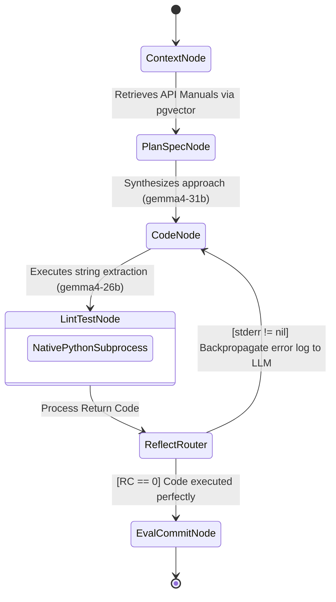
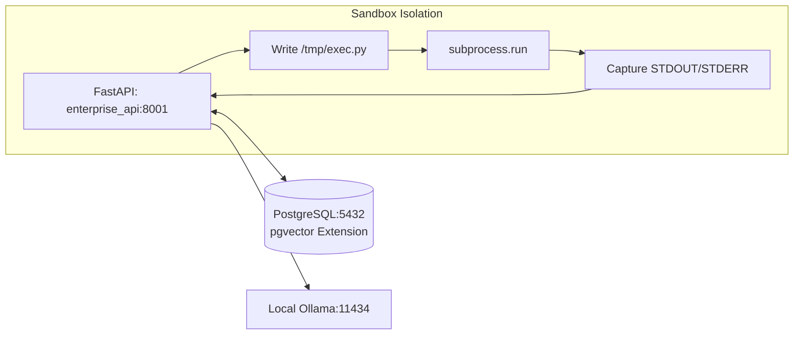
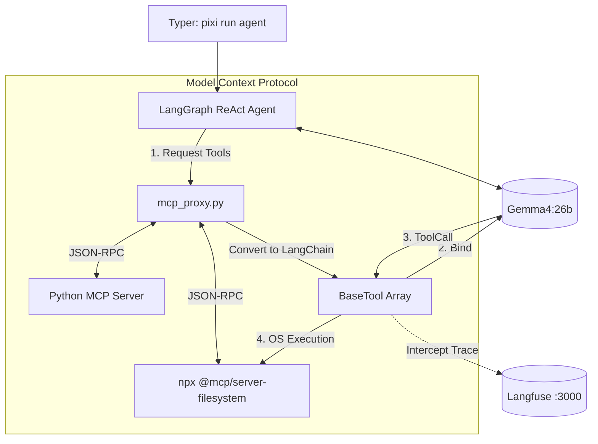
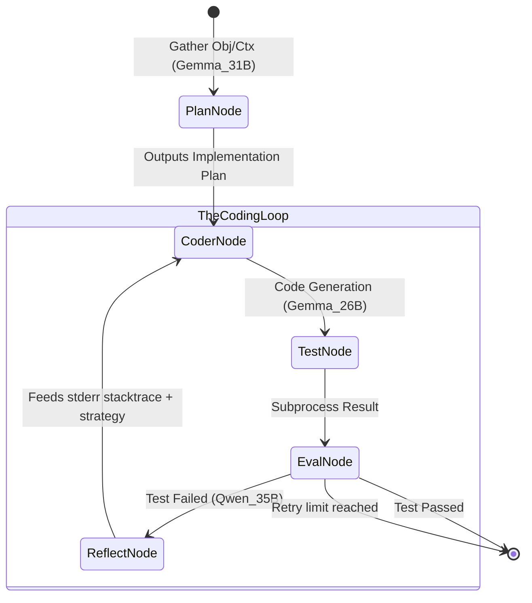

# Enterprise LangGraph Architecture

## Overview
The Phase 07 architecture introduces a sovereign loop optimized for self-correcting software development. It discards volatility in favor of the `AsyncPostgresSaver` Checkpointer to track cyclic reflections (`while` loops) strictly to Postgres.

## Core Auto-Coding Loop

## Infrastructure Topology

## Phase 08 Real-World Agent (MCP-Driven)

## Runtime Sequence Flow (Full-Duplex SSE & Memory)

```mermaid
sequenceDiagram
    participant UI as React Frontend
    participant API as FastAPI (Enterprise)
    participant Memory as AsyncPostgresSaver
    participant Graph as LangGraph StateMachine
    participant LLM as Gemma4 Worker
    participant Langfuse as Langfuse

    UI->>API: HTTP POST /api/autonomous/stream ({"task", "thread_id"})
    activate API
    
    API->>Memory: setup() & aget_state(thread_id)
    activate Memory
    Memory-->>API: Previous State (if thread_id exists)
    deactivate Memory
    
    API->>Graph: App.compile(checkpointer=Memory)
    API->>Graph: astream(inputs, config)
    activate Graph
    
    loop Every Node Execution
        Graph->>LLM: invoke()
        activate LLM
        LLM-->>Graph: Node payload (Plan / Code / Test Result)
        deactivate LLM
        
        Graph-->>API: Yield Node Update Dict (iterations, status)
        API-->>UI: SSE Chunk (data: {"type": "node_update", ...}\n\n)
        
        rect rgb(40, 50, 40)
            Note over Graph,Memory: State Persistence
            Graph->>Memory: Commit node state diff to PostgreSQL
        end
    end
    
    rect rgb(30, 40, 50)
        Note over Graph,Langfuse: Observability Boundary
        Graph-->>Langfuse: Push Trace Spans via CallbackHandler
    end
    
    Graph-->>API: final_state
    deactivate Graph
    API-->>UI: SSE Chunk (data: {"type": "finished", ...}\n\n)
    deactivate API
```

### Flow Description
* **Full-Duplex UI Streaming (SSE)**: Unlike normal HTTP cycles, `graph.py` converts LangGraph's internal `astream()` state dictionary updates into stringified JSON payloads en route. It actively broadcasts node transitions (e.g., entering `code_node`), live linting error logs from the sandbox, and iteration counts directly to the React component without waiting for the entire graph to complete.
* **Resilient Memory (`AsyncPostgresSaver`)**: Rather than running amnesiac ephemeral graphs, this layer forces checkpoint hydration. When the UI sends an existing `thread_id` UUID, the graph queries `pgvector`/PostgreSQL and seamlessly resumes from its exact last known state loop (skipping `plan_node` if a plan already exists, or entering directly into `Iteration 4` error reflections).
* **Guaranteed Observability under Uvicorn**: Overcoming ASGI worker fragmentation (where traces are lost in background threads), the `enterprise_api/main.py` utilizes Langfuse's default session handling mechanisms (`config["metadata"]["langfuse_session_id"] = thread_id`), mapping every `invoke()` from the agent flawlessly to `langgraph-mcp-agent` instantly.

### Design Principles & Rationale
1. **Checkpoint-Driven Determinism**: By backing the StateMachine strictly against a PostgreSQL Database (via `AsyncPostgresSaver`), we embrace structural determinism. If an agent hits an error loop and exhausts its iterations, or if the user halts the process, the exact branch state is permanently stored. We can "Rehydrate" the agent merely by invoking the same `thread_id`, completely bypassing redundant LLM reasoning.
2. **The Reflection Pattern (Fail-Fast Loop)**: The architecture explicitly assumes LLM generations are fundamentally unreliable. By isolating code generation from validation, we implement a constrained closed-loop reflection cycle (`CodeNode` <-> `LintTestNode` <-> `ReflectRouter`). The LLM is forced to confront and solve the exact AST/execution trace of its own bugs before moving forward.
3. **Execution Sandbox Limits (Paving the way for MCP)**: The decision to hardcode the `lint_test_node` evaluation engine against `subprocess.run(["python", "/tmp/auto_coder_exec.py"])` strictly highlights the architectural ceiling of hardcoded evaluation logic mapping. When it writes Go or background HTTP server constructs, the sandbox collapses. This constraint provides the theoretical justification for pivoting entirely to the Model Context Protocol (Phase 08) where the LLM can dynamically select the binary environments (`go run`, `curl`, `kubectl`) necessary for evaluation.

## Phase 09: Deterministic Autonomous Loop (Claude Code Clone)
Unlike the simple generic ReAct Agent compiled in Phase 08, Phase 09 introduces a strictly typed `StateGraph` mapping the professional Software Engineering cycle. Instead of guessing when to stop or what to test, this closed loop forces Test-Driven Development (TDD) via conditional gating parameters (`max_retries`).

### Heterogeneous Multi-Model Execution
To prevent infinite logic loops and prevent context window crashing, Phase 09 strictly employs a multi-model (Heterogeneous) architecture across the StateGraph:
1. **PlanNode (`gemma-4:31b`)**: Handles high-context semantic formulation.
2. **CoderNode (`gemma-4:26b` MoE)**: Provides high-speed execution/tool-calling within the loop.
3. **Eval/ReflectNode (`qwen3.5:35b-a3b`)**: Impartial, cross-family judge preventing "echo-chamber" code validation.

*Crucially*, the graph runner enforces strict `keep_alive: 0` VRAM garbage collection hooks between node phase transitions. This unloads inactive weights from Unified Memory, ensuring local Apple Silicon can orchestrate a 90B+ cumulative multi-agent pipeline sequentially without RAM thrashing. Phase 08 acts strictly as a "Sub-Agent" trapped entirely within the `CoderNode` logic.

### MCP Sandbox Routing & Authorization
To prevent total file system compromise, the Phase 09 architecture enforces an explicit boundary via the Model Context Protocol. The CLI implements an intelligent "Auto-Extract" regex parser (`(?:^|\s)(/[^\s\)\(]+)`) that aggressively scans the user's interactive prompts for absolute paths. These paths are extracted, dynamically authorized through an interactive user prompt, and loaded into the MCP Filesystem server as `allowed_dirs`. A critical security mechanism (`candidate != "/"`) prevents regex mutations—such as resolving the dirname of `./verify.sh`—from accidentally escalating permissions to the entire OS root directory, thereby maintaining strict containerization.

### Positive-Constraint Prompt Engineering
Local MoE and dense models (such as `gemma-4:26b` and `gemma-4:31b`) exhibit extreme susceptibility to "Negative Prompt Hallucinations" (also known as the Pink Elephant effect). The Phase 09 `CoderNode` architecture explicitly abandoned exclusionary negative constraints (e.g., *"NEVER use shorthand or paths like `/user-app/handler`"*) because these anchors inadvertently force the attention mechanisms of smaller models to actively manifest the forbidden paths. Instead, the architectural standard strictly employs absolute, declarative positive instructions (e.g., *"You MUST construct paths precisely starting with the allowed directory"*). This pivot effectively eliminates hallucinatory pathing errors and reduces fatal `Access denied` sandbox crashes.

## Phase 15: Enterprise AutoCoder (UI Streaming Integration)

Phase 15 formally promotes the Phase 09 CLI functionality into a persistent, React-driven UI component (`frontend/autocoder-lab`). By routing through the FastAPI backend (`enterprise_api:8001`), the architecture achieves cross-stack observability and seamless model coordination via Server-Sent Events (SSE).

### Streaming State Engine Integration
Instead of blocking HTTP requests, the backend instantiates a request-scoped `AutonomousAgent` for every `POST /api/autonomous/stream` call with dynamically extracted sandbox paths. The standard LangGraph `app.astream()` output is intercepted and formatted as typed SSE events for the React frontend:
- **`plan_node`**: Yields the full architectural plan markdown and test command specification from the 31B planner.
- **`coder_node`**: Yields execution status and iteration count from the 26B coding engine.
- **`test_node`**: Yields the complete subprocess stdout/stderr and the `validation_status` enum (`passed`/`failed`), rendered as a scrollable code block in the React panel.
- **`reflect_node`**: Yields the full reflection strategy markdown from the 35B Qwen evaluator when tests fail, providing complete observability into the error-correction reasoning.

### Dynamic YAML Routing
Phase 15 strictly unifies configuration by abandoning `.env` files in favor of `config.yaml` (`cmd/py/llm-utils/config.yaml`). The agent uses Python's `yaml` library to dynamically map the heterogeneous node structure (`planner_model`, `coder_model`, `evaluator_model`) to local Ollama endpoints upon execution.

### Direct Project Access (Deprecating Sandbox Injection)
Exposing standard OS temp directories (`/tmp`) violates the principle of least privilege. Initially, Phase 15 dynamically allocated a thread-scoped execution volume (`/tmp/autocoder_{thread_id}`) and injected it into the MCP filesystem arguments. However, this caused local models to confuse the empty sandbox with the project root. 

The architecture now relies on **Direct Project Access**. The backend dynamically parses project paths directly from user prompts (or `--dir` CLI flags) resolving them via `os.path.realpath`, and restricts the MCP filesystem bounding entirely to those extracted directories. The thread-isolated sandbox `/tmp/autocoder_{thread_id}` is still generated for scratch usage, but it is deliberately excluded from MCP tool descriptions to maintain clean semantic context and prevent infinite reasoning loops.
