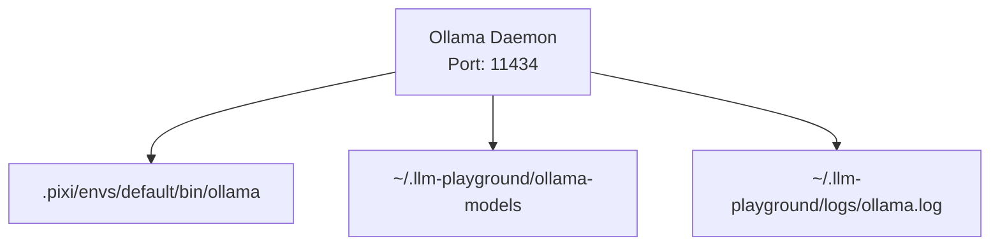

# Ollama Architecture
## Ecosystem Isolation
We implement Ollama using the pure Conda-forge binary mapped strictly into our `.pixi` sandbox, completely avoiding `brew` system pollution.

## Component Network

