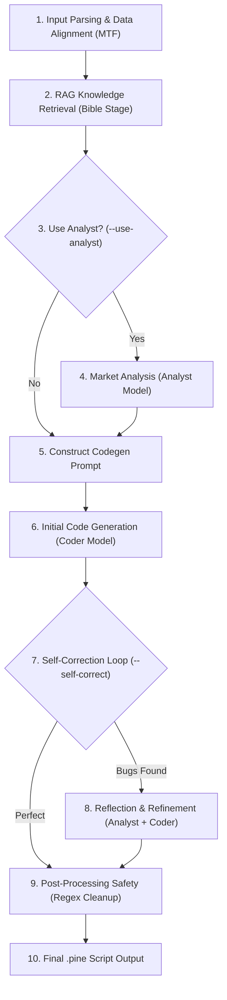

# Pine Script v6 Generation Workflow

This document outlines the systematic process used by `llm-utils` to generate high-quality, TradingView-compliant Pine Script v6 strategies.

## Workflow Overview

---

## Detailed Phase Descriptions

### 1. Input Parsing & Data Alignment (MTF)
- **Multi-Timeframe Support**: When multiple CSV files are provided (e.g., 1H and 1D), the system automatically detects the timeframes.
- **Synchronization**: It aligns historical data points based on the lowest timeframe (Baseline) to ensure the AI sees a consistent timeline across all resolutions.

### 2. RAG Knowledge Retrieval (The Bible Stage)
- **Context Gathering**: The system queries the Onyx RAG for specific Pine Script v6 documentation.
- **Bible Injection**: It prioritizes high-density reference files created in Phase 5:
    - `pine_v6_reference.md`: The definitive syntax and rule set.
    - `golden_templates.md`: Verified, high-quality code structures for Few-Shot learning.

### 3. Market Analysis (Optional Analyst Stage)
- **Role**: Performed by `deepseek-r1:32b`.
- **Function**: Interprets raw market data to identify trends, volatility, and key levels, providing a strategic "blueprint" for the coder model.

### 4. Initial Code Generation (Stage 2)
- **Role**: Performed by `qwen2.5-coder:32b`.
- **Function**: Combines the market data, analyst report, and RAG "Bible" context to write the initial strategy code.

### 5. Self-Correction Loop (Reflective Logic)
- **Automatic Critique**: The system passes the initial code back to the Analyst model.
- **Verification**: The Analyst checks the code against 5 mandatory v6 rules:
    1. No `ta.*` functions inside conditional scopes.
    2. Proper namespaces (`ta.`, `math.`, `request.`, etc.).
    3. Correct `strategy.exit` trailing stop patterns.
    4. Existence of mandatory `//@version=6` and `strategy()` headers.
    5. Correct tuple destructuring for multi-return functions.
- **Refinement**: If errors are identified, the system performs a second pass to fix them before manual audit is ever needed.

### 6. Post-Processing Safety Layer
- **Regex Cleanup**: A final programmatic layer that fixes common residual hallucinations:
    - Replaces `&&` with `and`, `||` with `or`.
    - Corrects `ta.volume()` to raw `volume` variable.
    - Strips invalid natural language fragments or comments.
    - Ensures mandatory `request.` prefixes on all security calls.

---

## Model Roles Summary

| Stage | Model | Responsibility |
| :--- | :--- | :--- |
| **Analysis / Critique** | `deepseek-r1:32b` | Logical reasoning, market interpretation, and syntax audit. |
| **Code Generation** | `qwen2.5-coder:32b` | Pine Script v6 implementation and logical translation. |
| **RAG Retrieval** | Onyx (BGE-M3 / Vespa) | Providing "Ground Truth" documentation and templates. |
