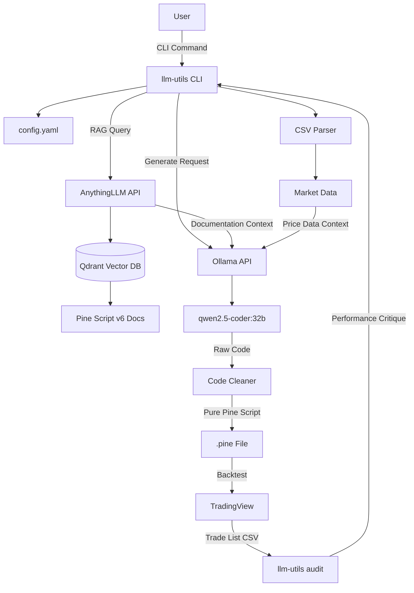
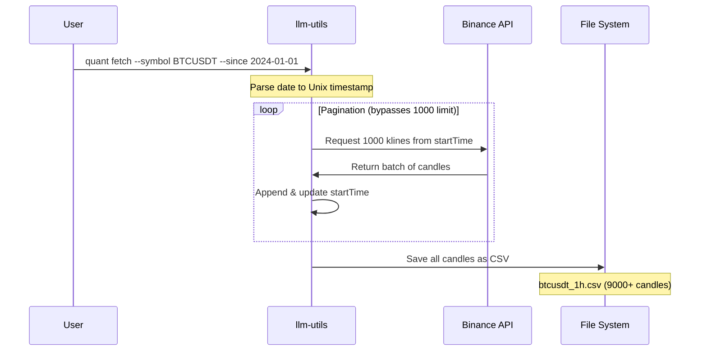
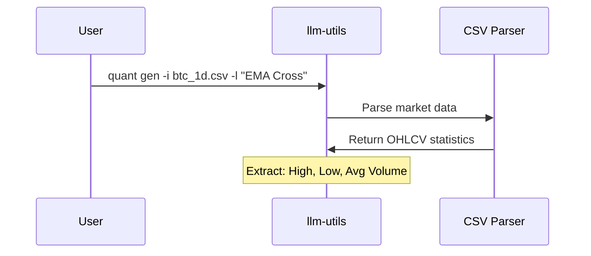
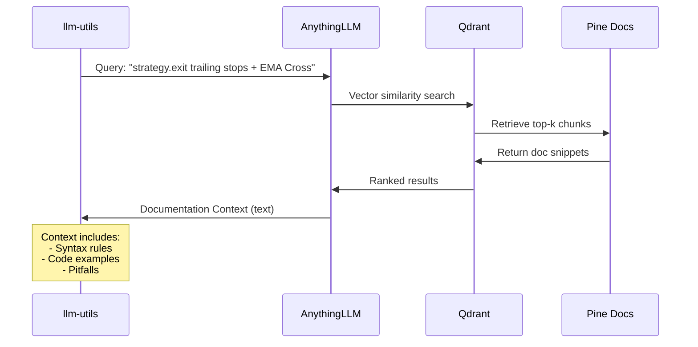
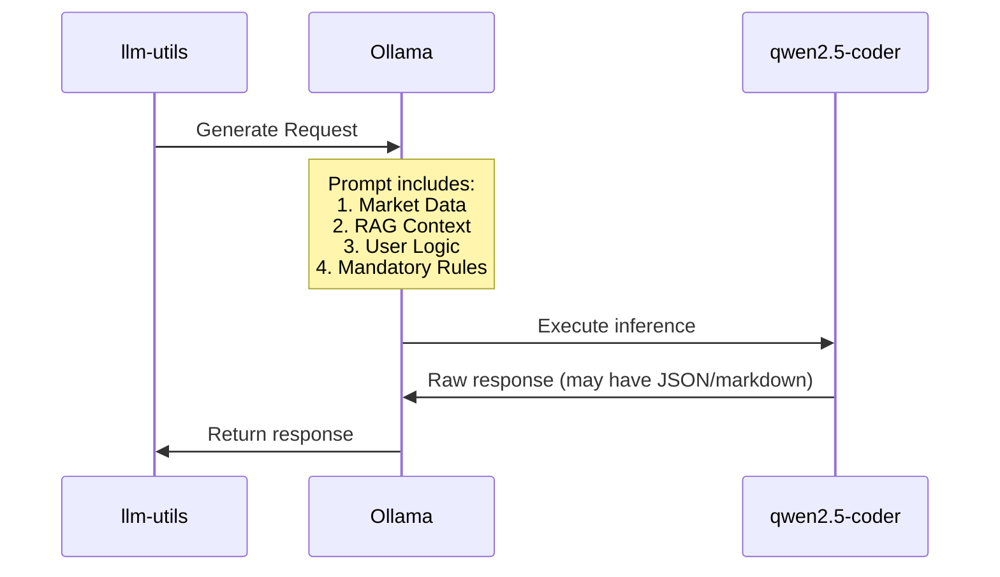
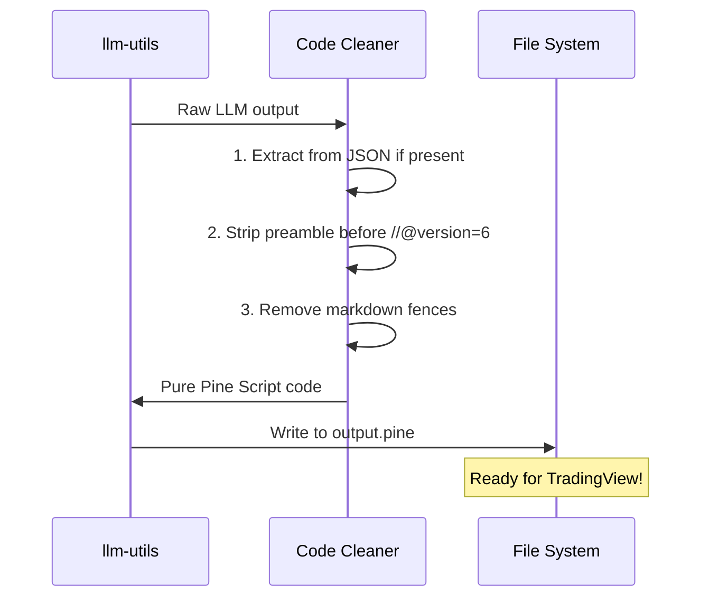
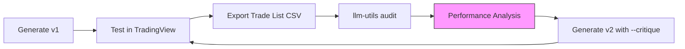

# AI Quant RAG System: Architecture & Workflow

This document explains the complete workflow and data flow of the AI Quant system with RAG (Retrieval-Augmented Generation).

## 🏗️ System Architecture Overview



## 🔄 Generation Workflow (Step-by-Step)

### Phase 0: Data Fetching (Optional)


**Pagination Feature:**
- Without `--since`: Single API call, max 1000 candles
- With `--since`: Automatic pagination, unlimited historical data
- System tracks last candle's CloseTime and recursively fetches next batch

### Phase 1: Data Collection


### Phase 2: RAG Context Retrieval


### Phase 3: Code Generation


### Phase 4: Code Cleaning & Output


## 🧠 RAG Knowledge Base Structure

The `documents/quant/` folder contains specialized Pine Script v6 references:

```
documents/quant/
├── pinescript_v6_migration.md      # v5 → v6 breaking changes
├── pinescript_v6_core_reference.md # Syntax, math, operators
├── pinescript_v6_ta_reference.md   # Technical indicators (ta.*)
├── pinescript_v6_strategy_reference.md # Strategy functions
├── pinescript_v6_pitfalls.md       # Common errors & anti-patterns
├── pinescript_v6_examples.md       # High-quality code templates
├── pinescript_v6_mtf_reference.md  # Multi-timeframe analysis
└── pinescript_v6_risk_management.md # Advanced exits & sizing
```

Each file is embedded into Qdrant via AnythingLLM's `Save and Embed` function.

## 🎯 Prompt Engineering Strategy

The Coder model receives a hardened prompt structure:

```
[Market Data Context]
High: $95,000 | Low: $16,000 | Avg Volume: 12.5B

[RAG Documentation Context]
<Retrieved from Vector DB based on user logic>

[Mandatory Rules]
1. ALL indicators at Level 0
2. TRAILING STOP PATTERN:
   stopTicks = math.round((close * percent) / syminfo.mintick)
   strategy.exit("ID", trail_price=close, trail_offset=stopTicks)
3. NO undefined variables (e.g., adx2)
4. USE namespaces: ta.*, strategy.*, math.*

[User Logic]
"EMA Cross with Trailing Stop"

[Output Format]
Pure Pine Script code starting with //@version=6
```

## 🔁 Audit & Refinement Loop



## 📊 Key Performance Metrics

| Component | Technology | Purpose |
|:---|:---|:---|
| **Data Fetcher** | Binance API (go-binance) | Multi-timeframe OHLCV download w/ pagination |
| **Vector DB** | Qdrant | Semantic search for docs |
| **RAG Orchestrator** | AnythingLLM | Workspace & embedding mgmt |
| **Coder Model** | Qwen2.5-Coder:32b | Code generation |
| **Analyst Model** | Custom (Plutus) | Performance critique |
| **CLI** | Go + Cobra | User interface |

## 🚀 Future Enhancements

1. **Automated Validation**: Run Pine Script linter before saving.
2. **Backtesting Integration**: Auto-submit to TradingView API for immediate results.
3. **Fine-tuning Pipeline**: Collect successful strategies to train a specialized model.
4. **Multi-Asset Support**: Extend to Forex, Stocks, and Crypto futures.
