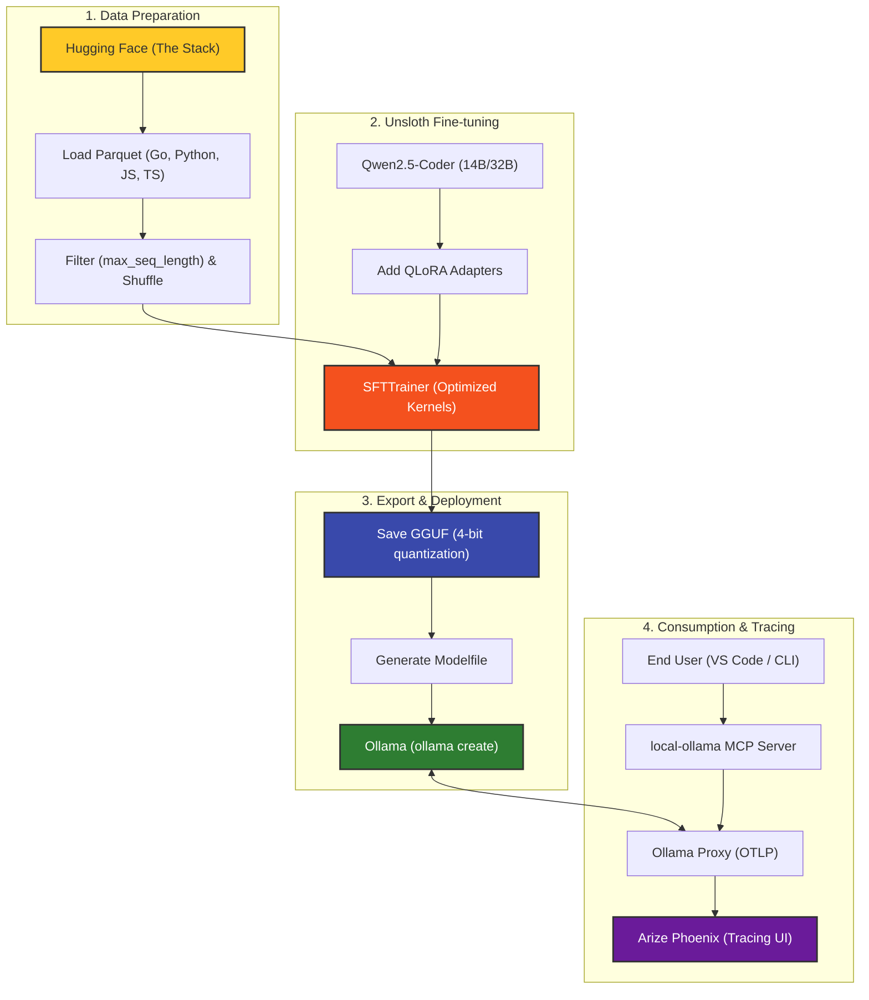

# Unsloth Fine-tuning & Export Flow

This diagram illustrates the end-to-end workflow from dataset loading to model consumption in Ollama.

## Flow Description

1. **Data Prep**: We pull multi-language samples from 'The Stack' dataset, filter by sequence length, and shuffle to create a balanced training set.
2. **Fine-tuning**: We use Unsloth's optimized `FastLanguageModel` and `SFTTrainer`. For 32B models, aggressive VRAM optimizations (shorter context, lower rank) are applied.
3. **Export**: The fine-tuned weights are quantized and converted to GGUF format. A `Modelfile` is generated to simplify the Ollama import.
4. **Consumption**: Requests from the MCP server pass through an `ollama-proxy` to capture traces for `Arize Phoenix` before reaching the model.
