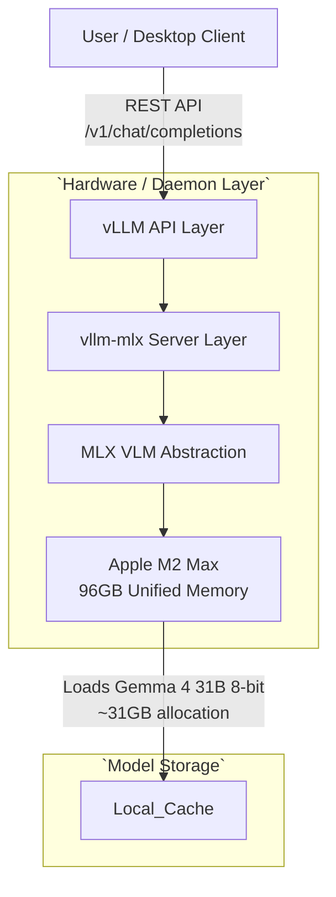

# vllm-mlx Architecture

## Overview
`vllm-mlx` introduces OpenAI and Anthropic compatible APIs backed by Apple Silicon's natively optimized MLX framework. This brings unprecedented throughput for local LLM and VLM instances on Mac hardware, especially given unified memory systems unconstrained by standard explicit VRAM limits.

## System Design and Flow

## Hardware Profile
The baseline constraint mapping guarantees support up to `gemma-4-31b-8bit` relying on the host's 96GB unified memory architecture. The 8-bit quantification is chosen systematically over 4-bit configurations because 31GB memory pressure comfortably fits alongside standard host operating loads on a 96GB ceiling, optimizing for accuracy while eliminating out-of-memory overhead mapping.
